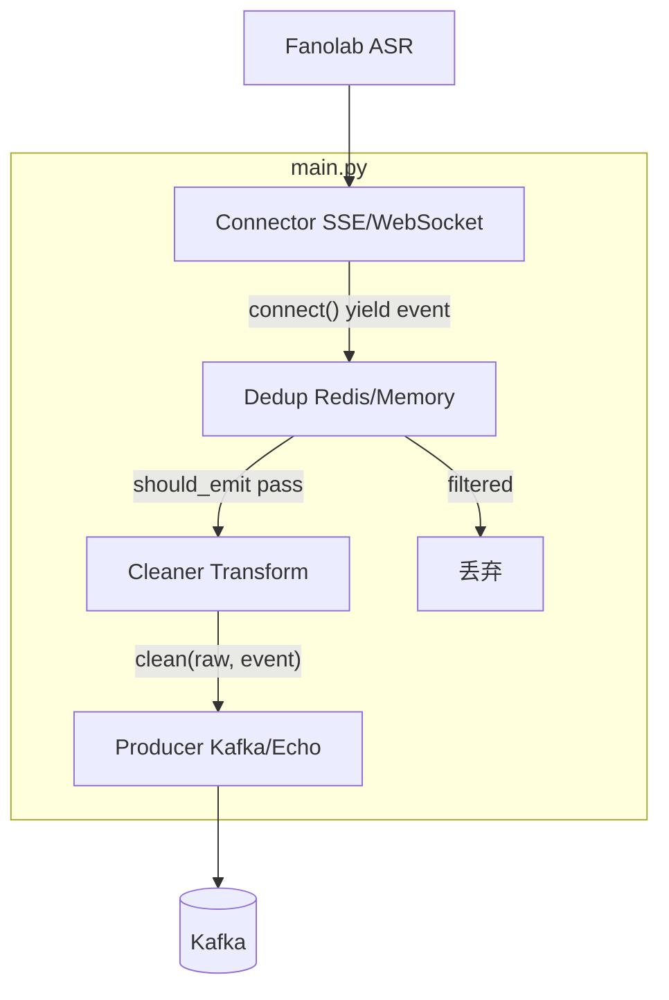
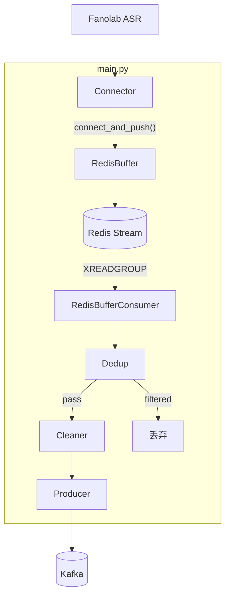
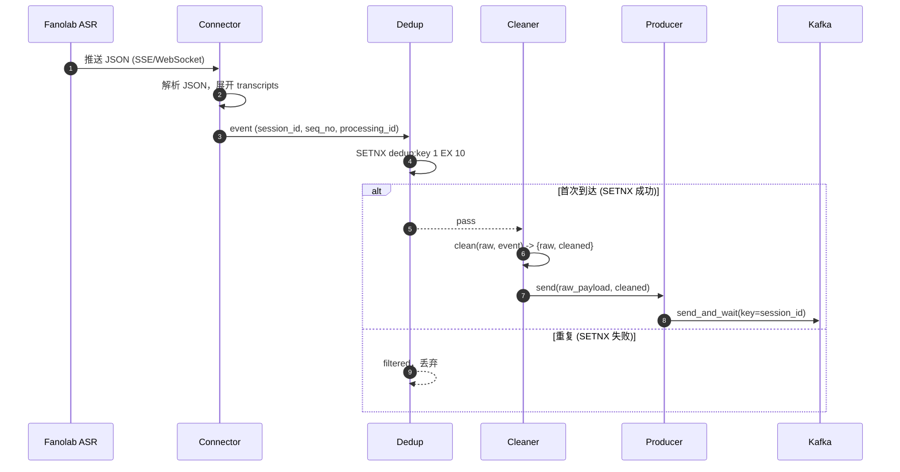
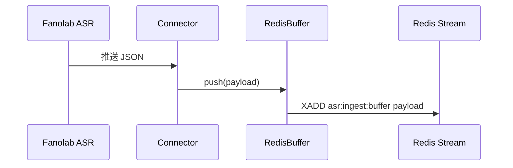
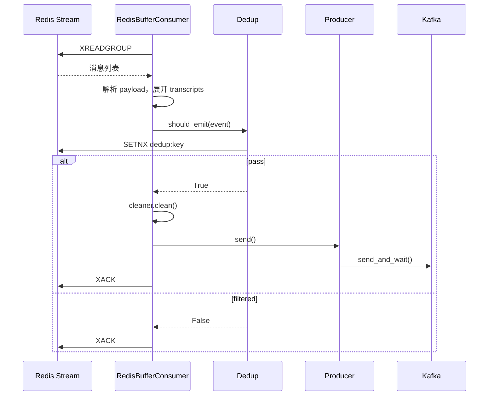

# ASR Ingest

> AWS 实时 ASR 转录接入与分发服务。从 Fanolab ASR 接收转录结果，去重后异步推送到 Kafka。

---

## 目录

- [1. 项目简介](#1-项目简介)
- [2. 架构设计](#2-架构设计)
- [3. 环境要求](#3-环境要求)
- [4. 安装指南](#4-安装指南)
- [5. 配置说明](#5-配置说明)
- [6. 使用教程](#6-使用教程)
- [7. 项目结构](#7-项目结构)
- [8. 部署指南](#8-部署指南)
- [9. 常见问题](#9-常见问题)
- [10. 相关文档](#10-相关文档)

---

## 1. 项目简介

ASR Ingest 是一个轻量级数据搬运服务，负责：

1. **接入**：通过 SSE 或 WebSocket 长连接接收 Fanolab ASR 的实时转录数据
2. **去重**：基于 Redis SETNX 对 `session_id`、`processing_id`、`seq_no` 进行去重
3. **分发**：将去重后的数据写入 Kafka，供下游 NLP、质检等业务消费

支持 Demo 模式（无需 Redis/Kafka）和 Redis Buffer 模式（断点恢复）。

---

## 2. 架构设计

### 2.1 模块调用图

**直连模式（Demo / 未启用 Buffer）**：



**生产模式（Redis Buffer 启用）**：



### 2.2 时序图

**直连模式：单条转录从接收到写入 Kafka**：



**Redis Buffer 模式：写入与消费分离**：

*接收阶段*



*消费阶段（异步）*



### 2.3 数据流概览

| 模式 | 数据流 |
|------|--------|
| 直连 | ASR → Connector → Dedup → Cleaner → Producer → Kafka |
| Buffer | ASR → Connector → Redis Stream → Consumer → Dedup → Cleaner → Producer → Kafka |

收到数据先落 Redis Stream，再异步消费，服务中断时可从 Pending 恢复。

### 2.4 核心模块

| 模块 | 职责 |
|------|------|
| Connector | SSE/WebSocket 长连接，解析 Vendor JSON |
| Dedup | 可配置 Key 去重（默认 session_id:processing_id:seq_no） |
| Transform | 数据清洗，输出 raw + cleaned |
| Buffer | Redis Stream 缓冲（可选） |
| Producer | Kafka 或 EchoProducer（Demo） |

---

## 3. 环境要求

| 项目 | 要求 |
|------|------|
| Python | 3.11+ |
| 生产环境 | Redis (ElastiCache)、Kafka (MSK) |
| Demo 模式 | 无需 Redis/Kafka |

---

## 4. 安装指南

### 4.1 使用 Poetry（推荐）

```bash
# 安装依赖
poetry install

# 安装开发依赖（含 pytest、streamlit）
poetry install --with dev

# 激活虚拟环境
poetry shell
```

### 4.2 使用 pip + venv

```bash
# 创建虚拟环境
python -m venv .venv

# 激活（Windows PowerShell）
.\.venv\Scripts\Activate.ps1

# 安装
pip install -e ".[dev]"
```

### 4.3 验证安装

```bash
python -c "import asr_ingest; print('OK')"
```

---

## 5. 配置说明

### 5.1 环境变量

复制 `.env.example` 为 `.env` 并修改：

```bash
cp .env.example .env
```

### 5.2 配置项一览

| 变量 | 默认值 | 说明 |
|------|--------|------|
| DEMO_MODE | true | 使用 MemoryDedup + EchoProducer，无需 Redis/Kafka |
| FANOLAB_URL | http://localhost:8765/sse | Fanolab SSE/WebSocket 地址 |
| MODE | sse | 传输协议：`sse` 或 `websocket` |
| REDIS_URL | redis://localhost:6379/0 | Redis 连接地址 |
| KAFKA_BOOTSTRAP_SERVERS | localhost:9092 | Kafka 集群地址 |
| KAFKA_TOPIC | asr_realtime_text | Kafka Topic 名称 |
| STOP_TIMEOUT | 120 | 优雅停机超时（秒） |
| dedup_key_parts | session_id,processing_id,seq_no | 去重 Key 组成 |
| redis_buffer_enabled | true | 是否启用 Redis Stream 缓冲 |
| redis_buffer_stream | asr:ingest:buffer | Redis Stream 名称 |
| redis_buffer_consumer_group | asr:ingest:consumer | 消费组名称 |
| redis_buffer_maxlen | 10000 | Stream 最大长度 |
| cleaner_mode | default | 数据清洗模式：`default`、`identity` |

### 5.3 cleaner_mode 详细说明

`cleaner_mode` 控制 Transform 层的数据清洗行为，决定写入 Kafka 的 payload 结构。

| 模式 | 说明 | 输出结构 |
|------|------|----------|
| `default` | 提取结构化字段，同时保留原始 payload | `{raw, cleaned}` |
| `identity` | 透传原始 payload，不做字段提取 | `{raw}` |

#### default 模式

从 `TranscriptionEvent` 提取标准化字段，便于下游消费；同时保留 `raw` 供审计或回放。

**输入示例**（Vendor 原始 JSON）：

```json
{
  "result": {
    "callStatus": { "sessionId": "sess-001" },
    "processingStatus": "completed",
    "processingId": "proc-123",
    "transcripts": [
      {
        "seqNo": 0,
        "transcript": "你好，请问有什么可以帮您？",
        "role": "Agent",
        "createdAt": "2025-03-06T10:00:00Z"
      }
    ]
  }
}
```

**输出示例**（Producer 写入 Kafka 的 payload）：

```json
{
  "raw": { "result": { "callStatus": { "sessionId": "sess-001" }, "transcripts": [...] } },
  "cleaned": {
    "session_id": "sess-001",
    "seq_no": 0,
    "transcript": "你好，请问有什么可以帮您？",
    "role": "Agent",
    "created_at": "2025-03-06T10:00:00Z",
    "processing_status": "completed",
    "processing_id": "proc-123"
  }
}
```

#### identity 模式

仅透传原始 payload，不提取 `cleaned` 字段。适用于下游直接消费 Vendor 格式、或需要完整原始数据的场景。

**输入示例**（同上）

**输出示例**：

```json
{
  "raw": {
    "result": {
      "callStatus": { "sessionId": "sess-001" },
      "processingStatus": "completed",
      "processingId": "proc-123",
      "transcripts": [
        {
          "seqNo": 0,
          "transcript": "你好，请问有什么可以帮您？",
          "role": "Agent",
          "createdAt": "2025-03-06T10:00:00Z"
        }
      ]
    }
  }
}
```

#### 使用建议

| 场景 | 推荐模式 |
|------|----------|
| 下游需要标准化字段（session_id、seq_no、transcript 等） | `default` |
| 下游直接解析 Vendor 原始结构 | `identity` |
| 需要审计/回放原始数据 | `default`（同时保留 raw） |
| 仅需透传、不关心结构化 | `identity` |

**配置示例**：

```env
# 使用默认清洗（raw + cleaned）
cleaner_mode=default

# 透传原始数据
cleaner_mode=identity
```

### 5.4 配置示例

**Demo 模式（本地开发）**：

```env
DEMO_MODE=true
FANOLAB_URL=http://localhost:8765/sse
MODE=sse
```

**生产模式**：

```env
DEMO_MODE=false
FANOLAB_URL=https://your-fanolab.example.com/sse
MODE=sse
REDIS_URL=redis://your-elasticache:6379/0
KAFKA_BOOTSTRAP_SERVERS=your-msk:9092
```

---

## 6. 使用教程

### 6.1 运行 E2E Demo（零依赖）

无需 Redis、Kafka，Mock 服务器自动启动：

```bash
python -m asr_ingest.demo.run_e2e
```

输出：`demo_output.jsonl` 及控制台日志。

### 6.2 运行 Streamlit Demo（可视化）

```bash
streamlit run src/asr_ingest/demo/streamlit_app.py
```

提供：

- 输入源预览
- 对话记录
- Redis 去重视图
- Kafka 消息视图
- 注入重复、乱序场景验证

### 6.3 运行生产服务

```bash
# 确保 DEMO_MODE=false，并配置 Redis、Kafka
python -m asr_ingest.main
```

### 6.4 运行测试

```bash
pytest tests/ -v
```

---

## 7. 项目结构

```
transcribe_service/
├── config/                 # 配置
│   └── settings.py         # Pydantic Settings
├── src/asr_ingest/        # 主包
│   ├── main.py             # 入口
│   ├── connector/          # SSE/WebSocket 接入
│   ├── dedup/              # 去重（Redis/Memory）
│   ├── transform/          # 数据清洗
│   ├── buffer/             # Redis Stream 缓冲
│   ├── producer/            # Kafka/Echo 输出
│   ├── shutdown/           # 优雅停机
│   └── demo/               # E2E Demo、Streamlit
├── tests/                  # 测试
├── docker/                 # Dockerfile
├── docs/                   # 文档
├── reference/              # 设计参考
├── pyproject.toml
├── requirements.txt
└── .env.example
```

---

## 8. 部署指南

### 8.1 Docker 构建

```bash
docker build -f docker/Dockerfile -t asr-ingest:latest .
```

### 8.2 目标环境

- **AWS ECS Fargate**
- 需 VPC、ElastiCache Redis、MSK

详细步骤见项目内 `docs/` 目录下的部署文档。

---

## 9. 常见问题

### Q1：Demo 模式下连接失败，提示 502？

确保先启动 Mock 服务器。运行 `python -m asr_ingest.demo.run_e2e` 会自动启动；若单独运行 Streamlit，需先执行一次 E2E 或手动启动 Mock。

### Q2：生产模式如何启用 Redis Buffer？

设置 `DEMO_MODE=false` 且 `redis_buffer_enabled=true`（默认）。数据会先写入 Redis Stream，再异步消费到 Kafka。

### Q3：如何修改去重 Key？

通过 `dedup_key_parts` 配置，支持 `session_id`、`processing_id`、`seq_no`、`created_at` 的组合，逗号分隔。

### Q4：Kafka 消息顺序如何保证？

使用 `session_id` 作为 Kafka 消息 Key，相同 session 会落入同一分区，分区内严格有序。

---

## 10. 相关文档

| 文档 | 说明 |
|------|------|
| [development-plan.md](development-plan.md) | 开发计划 |
| [reference/design.md](reference/design.md) | 架构设计 |
| docs/ | 优化方案、部署指南等 |
