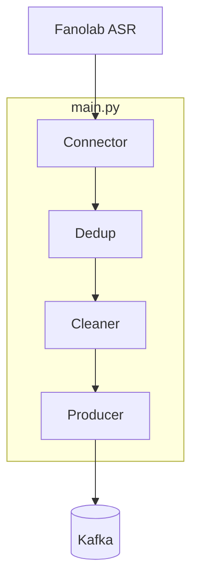
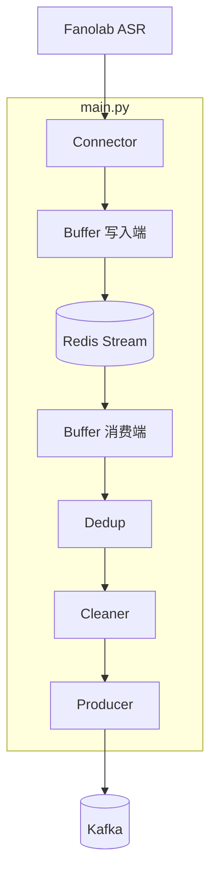

# ASR Ingest

> AWS 实时 ASR 转录接入与分发服务。从 Fanolab ASR 接收转录结果，去重后异步推送到 Kafka。

---

## 目录

- [1. 项目简介](#1-项目简介)
- [2. 架构设计](#2-架构设计)
- [3. 环境要求](#3-环境要求)
- [4. 安装指南](#4-安装指南)
- [5. 配置说明](#5-配置说明)
- [6. 使用教程](#6-使用教程)
- [7. 项目结构](#7-项目结构)
- [8. 部署指南](#8-部署指南)
- [9. 常见问题](#9-常见问题)
- [10. 相关文档](#10-相关文档)

---

## 1. 项目简介

ASR Ingest 是一个轻量级数据搬运服务，负责：

1. **接入**：通过 SSE 或 WebSocket 长连接接收 Fanolab ASR 的实时转录数据
2. **去重**：基于 Redis SETNX 对 `session_id`、`processing_id`、`seq_no` 进行去重
3. **分发**：将去重后的数据写入 Kafka，供下游 NLP、质检等业务消费

支持 Demo 模式（Mock + 前端注入）和 Redis Buffer 模式（断点恢复、Kafka 不可用时消息保留在 Buffer 自动重试）。

---

## 2. 架构设计

### 2.1 角色说明

| 角色 | 代码模块 | 职责 |
|------|----------|------|
| **Connector** | connector/ | 连接 Fanolab ASR，接收 SSE/WebSocket 推送的 JSON |
| **Buffer 写入端** | buffer/RedisBuffer | 将 Connector 收到的 payload 写入 Redis Stream |
| **Buffer 消费端** | buffer/RedisBufferConsumer | 从 Redis Stream 读取 → 去重 → 清洗 → 写入 Kafka |
| **Dedup** | dedup/ | 按 Key 去重，发送失败时撤销记录以支持重试 |
| **Cleaner** | transform/ | 数据清洗，输出 `raw` + `cleaned` |
| **Producer** | producer/ | 写入 Kafka |

> 说明：本服务只**生产** Kafka 消息，不消费 Kafka。下游业务（NLP、质检等）自行消费 Kafka。

### 2.2 模块调用图

**直连模式**（`REDIS_BUFFER_ENABLED=false`）：Connector 收到数据后直接去重、清洗、写 Kafka。



**Buffer 模式**（`REDIS_BUFFER_ENABLED=true`，默认）：数据先落 Redis Stream，由 Buffer 消费端异步读取并写入 Kafka。



### 2.3 数据流

| 模式 | 数据流 |
|------|--------|
| 直连 | ASR → Connector → Dedup → Cleaner → Producer → Kafka |
| Buffer | ASR → Connector → Buffer 写入端 → Redis Stream → Buffer 消费端 → Dedup → Cleaner → Producer → Kafka |

Buffer 模式下，数据先落 Redis Stream，再由 Buffer 消费端异步读取并写入 Kafka；服务中断或 Kafka 不可用时，消息保留在 Stream，恢复后自动重试。

---

## 3. 环境要求

| 项目 | 要求 |
|------|------|
| Python | 3.11+ |
| 生产环境 | Redis (ElastiCache)、Kafka (MSK) |
| 本地开发 | Redis、Kafka（`docker compose up -d`） |

---

## 4. 安装指南

### 4.1 使用 Poetry（推荐）

```bash
poetry install
poetry install --with dev   # 含 pytest
poetry shell
```

### 4.2 使用 pip + venv

```bash
python -m venv .venv
.\.venv\Scripts\Activate.ps1   # Windows
pip install -e ".[dev]"
```

### 4.3 验证

```bash
python -c "import asr_ingest; print('OK')"
```

---

## 5. 配置说明

### 5.1 环境变量

复制 `.env.example` 为 `.env` 并修改。**环境变量统一使用 UPPER_SNAKE_CASE**。

```bash
cp .env.example .env
```

### 5.2 配置项一览

#### Fanolab ASR

| 变量 | 默认值 | 说明 |
|------|--------|------|
| `FANOLAB_URL` | http://localhost:8765/sse | Fanolab SSE/WebSocket 地址 |
| `MODE` | sse | 传输协议：`sse` 或 `websocket` |
| `SSE_READ_TIMEOUT` | 空 | SSE 读超时（秒），空=无限制 |
| `WS_PING_INTERVAL` | 20.0 | WebSocket ping 间隔（秒） |
| `WS_PING_TIMEOUT` | 20.0 | WebSocket pong 超时（秒） |

#### Redis

| 变量 | 默认值 | 说明 |
|------|--------|------|
| `REDIS_URL` | redis://localhost:6379/0 | Redis 连接地址 |
| `DEDUP_KEY_PARTS` | session_id,processing_id,seq_no | 去重 Key 组成 |
| `DEDUP_TTL_SECONDS` | 60 | 去重 Key 过期时间（秒） |

#### Redis Buffer

| 变量 | 默认值 | 说明 |
|------|--------|------|
| `REDIS_BUFFER_ENABLED` | true | 是否启用 Redis Stream 缓冲 |
| `REDIS_BUFFER_STREAM` | asr:ingest:buffer | Redis Stream 名称 |
| `REDIS_BUFFER_CONSUMER_GROUP` | asr:ingest:consumer | 消费组名称 |
| `REDIS_BUFFER_MAXLEN` | 10000 | Stream 最大长度 |

#### Kafka

| 变量 | 默认值 | 说明 |
|------|--------|------|
| `KAFKA_BOOTSTRAP_SERVERS` | localhost:9092 | Kafka 集群地址 |
| `KAFKA_TOPIC` | asr_realtime_text | Topic 名称 |
| `KAFKA_COMPRESSION_TYPE` | none | 压缩：`none`、`gzip`、`snappy`、`lz4` |
| `KAFKA_SEND_TIMEOUT_SEC` | 10 | 发送超时（秒），Kafka 不可用时超时并输出错误日志 |

#### 长连接与重连

| 变量 | 默认值 | 说明 |
|------|--------|------|
| `RECONNECT_ENABLED` | true | 自动重连 |
| `RECONNECT_MAX_RETRIES` | 0 | 最大重试次数，0=无限 |
| `RECONNECT_INITIAL_DELAY` | 1.0 | 初始退避延迟（秒） |
| `RECONNECT_MAX_DELAY` | 60.0 | 最大退避延迟（秒） |
| `RECONNECT_BACKOFF_FACTOR` | 2.0 | 退避因子 |

#### 其它

| 变量 | 默认值 | 说明 |
|------|--------|------|
| `CLEANER_MODE` | default | 数据清洗：`default`（raw+cleaned）、`identity`（透传） |
| `STOP_TIMEOUT` | 120 | 优雅停机超时（秒） |
| `LOG_LEVEL` | INFO | 日志级别 |
| `LOG_FORMAT` | auto | 日志格式：`json`、`console`、`auto` |

### 5.3 配置示例

**本地开发**：

```env
FANOLAB_URL=http://localhost:8765/sse
MODE=sse
REDIS_URL=redis://localhost:6379/0
KAFKA_BOOTSTRAP_SERVERS=localhost:9092
```

**生产**：

```env
FANOLAB_URL=https://your-fanolab.example.com/sse
MODE=sse
REDIS_URL=redis://your-elasticache:6379/0
KAFKA_BOOTSTRAP_SERVERS=your-msk:9092
KAFKA_COMPRESSION_TYPE=gzip
LOG_FORMAT=json
```

### 5.4 CLEANER_MODE 说明

| 值 | 说明 | Kafka 输出 |
|------|------|------------|
| `default` | 提取结构化字段 + 保留原始 | `{raw, cleaned}` |
| `identity` | 透传原始 payload | `{raw}` |

---

## 6. 使用教程

### 6.1 本地 Demo（Mock + 前端注入）

```bash
docker compose up -d
python -m asr_ingest.demo.run_local
```

浏览器打开 `http://127.0.0.1:8765/`，输入 JSON 点击「发送」，控制台打印完整链路日志。

### 6.2 生产服务

```bash
docker compose up -d
python -m asr_ingest.main
```

### 6.3 服务地址（docker compose）

| 服务 | 地址 |
|------|------|
| Redis | localhost:6379 |
| Kafka | localhost:9092 |
| Kafka UI | http://localhost:8080（详见 [docs/kafka-ui-usage.md](docs/kafka-ui-usage.md)） |

### 6.4 测试

```bash
pytest tests/ -v
```

---

## 7. 项目结构

```
transcribe_service/
├── config/
│   └── settings.py           # Pydantic Settings
├── src/asr_ingest/
│   ├── main.py               # 入口
│   ├── connector/            # SSE/WebSocket 接入
│   ├── dedup/                # 去重（Redis）
│   ├── transform/            # 数据清洗
│   ├── buffer/               # Redis Stream（写入端 + 消费端）
│   ├── producer/             # Kafka 输出
│   ├── shutdown/              # 优雅停机
│   └── demo/                  # run_local（Mock + 前端）
├── tests/
├── docker/
│   └── Dockerfile
├── docs/
├── reference/
├── docker-compose.yml        # Redis + Kafka + Kafka UI
├── pyproject.toml
├── requirements.txt
└── .env.example
```

---

## 8. 部署指南

```bash
docker build -f docker/Dockerfile -t asr-ingest:latest .
```

目标环境：AWS ECS Fargate，需 VPC、ElastiCache Redis、MSK。详见 `docs/` 目录。

---

## 9. 常见问题

### Q1：启动报 Redis/Kafka 不可用？

启动前会校验 Redis、Kafka 连通性，失败则输出 `Pipeline: 启动失败（Redis 不可用）` 或 `Pipeline: 启动失败（Kafka 不可用）` 并退出。确保 `docker compose up -d` 已执行。

### Q2：连接 ASR 失败，502？

配置 `FANOLAB_URL` 为真实 ASR 地址。若服务未就绪，会输出 `Reconnect: 连接 ASR 失败（Fanolab 服务未就绪，将自动重试）`。

### Q3：Kafka 挂了会怎样？

Buffer 模式下，Buffer 消费端发送失败时消息保留在 Redis Stream，不执行 XACK；约 10 秒超时后输出 `Buffer Consumer: 处理消息失败（Kafka 不可用，消息已保留在 Buffer，将自动重试）`。Kafka 恢复后自动重试。

### Q4：如何修改去重 Key？

通过 `DEDUP_KEY_PARTS` 配置，支持 `session_id`、`processing_id`、`seq_no`、`created_at` 的组合，逗号分隔。

### Q5：Kafka 消息顺序？

使用 `session_id` 作为 Kafka 消息 Key，相同 session 落入同一分区，分区内有序。

### Q6：Buffer 和 Dedup 如何配合？

- **Buffer**：Redis Stream 持久化 raw payload。Buffer 消费端读取后，成功写入 Kafka 则 XACK + XDEL；发送失败则不 XACK，消息保留在 Stream 待重试。
- **Dedup**：按 `(session_id, processing_id, seq_no)` 去重。发送失败时撤销 dedup 记录，重试时可再次发送。

---

## 10. 相关文档

| 文档 | 说明 |
|------|------|
| [docs/pyproject-config.md](docs/pyproject-config.md) | pyproject.toml 配置说明 |
| [docs/kafka-ui-usage.md](docs/kafka-ui-usage.md) | Kafka UI 使用说明 |
| [reference/](reference/) | 设计参考 |
