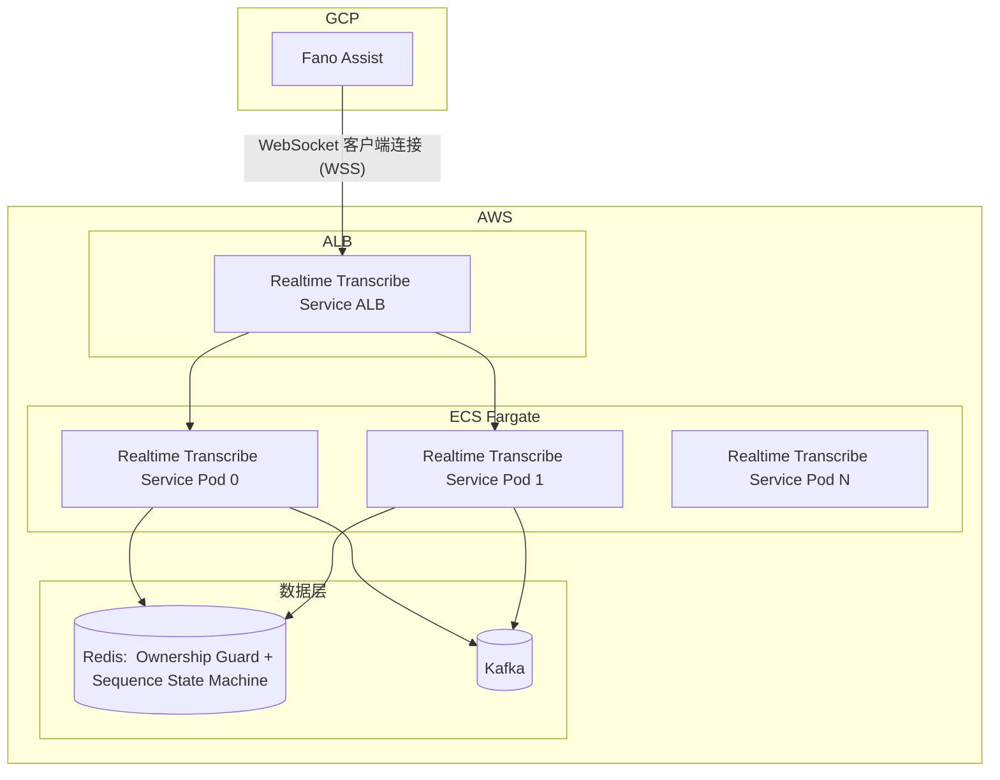
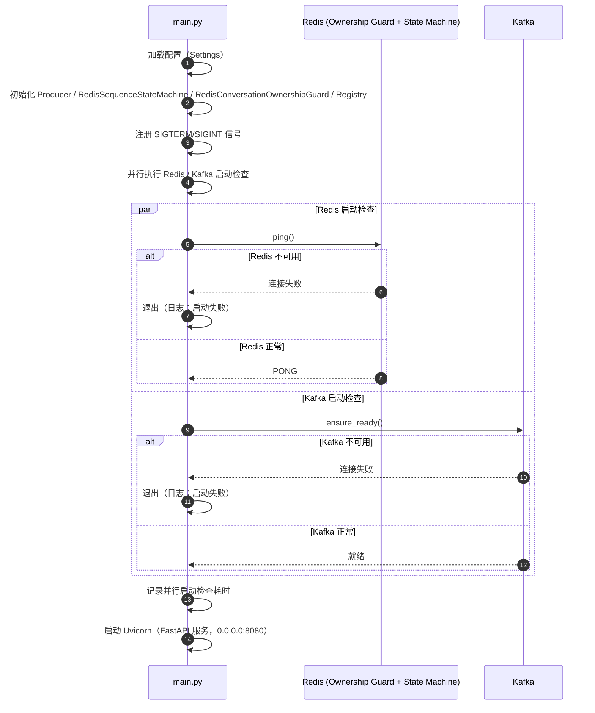
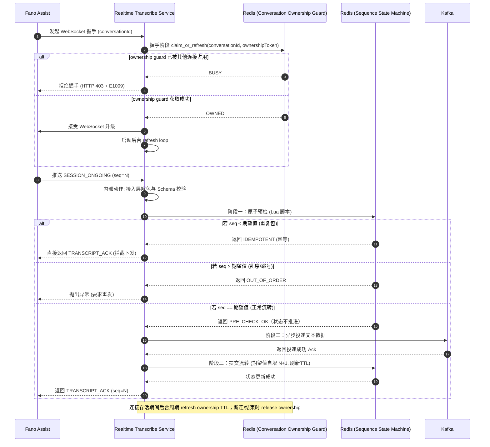
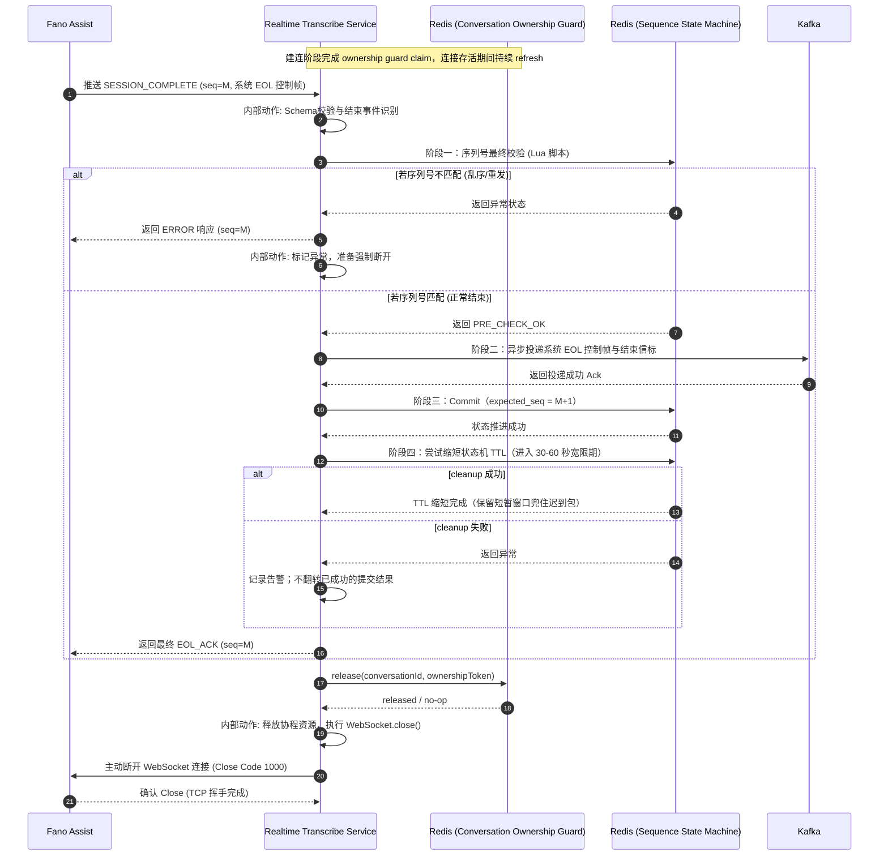
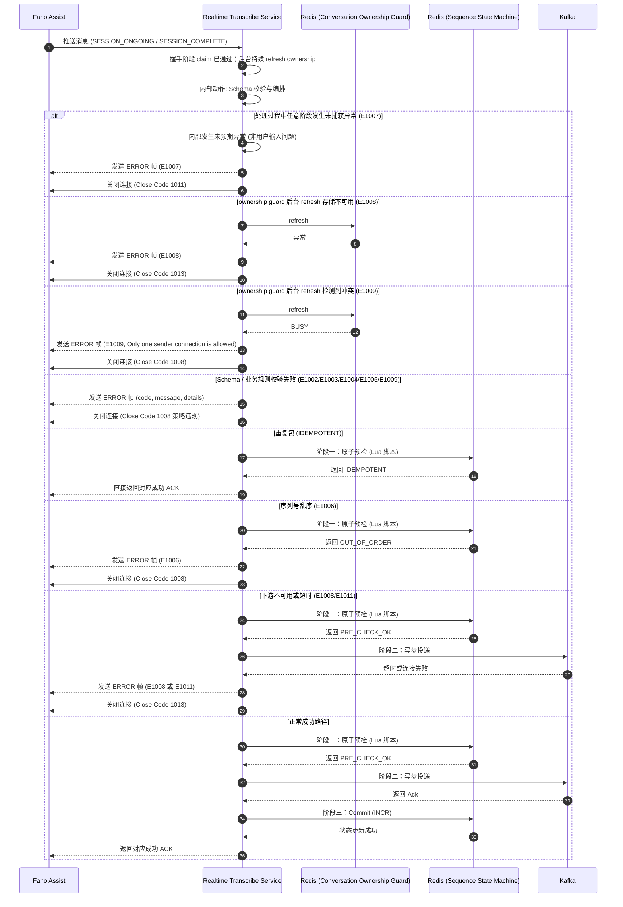
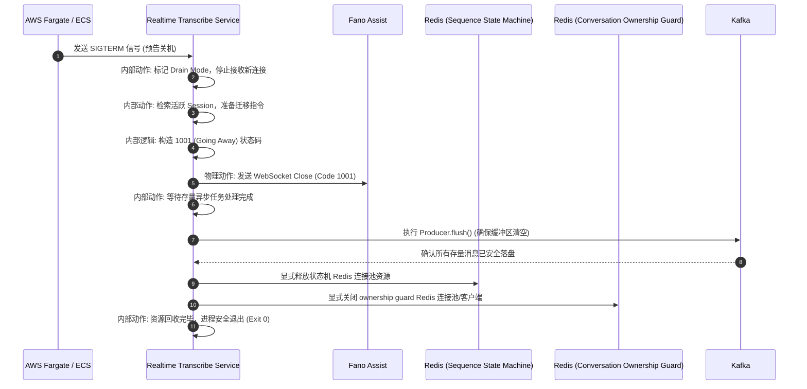

# Realtime Transcribe Service 设计总览

---

## 1. 设计总览

### 1.1 业务背景

在呼叫中心智能化升级背景下，Fano Assist 作为 ASR（自动语音识别）引擎客户端（该引擎**由本行代为托管并部署于本行 GCP 环境中**）负责将客服通话语音实时转化为文本。

**Realtime Transcribe Service** 部署于本行 AWS 环境，作为连接 GCP 与 AWS 内部数据生态的**核心多云实时数据网关**。

### 1.2 业务目标

| 目标           | 指标                                     |
| -------------- | ---------------------------------------- |
| **并发容量**   | 早高峰 700～1,000 路并发通话（设计目标） |
| **端到端延迟** | TBC（GCP 接收 → AWS Kafka）              |
| **数据完整性** | 严格保序、零丢失                         |

### 1.3 职责边界

| 类型                    | 范围                                                         |
| --------------------- | ---------------------------------------------------------- |
| **In-Scope（系统内）**     | 多云长连接管理；基于 conversationId/sequenceNumber 的保序校验；可靠投递至 Kafka |
| **Out-of-Scope（系统外）** | 不处理音频流；不包含意图识别、情感分析等业务逻辑；下游需自行订阅 Kafka                     |

### 1.4 核心架构要点

- **连接模式**：Fano Assist 作为 WebSocket 客户端，主动连接 Realtime Transcribe Service（服务端）
- **保序机制**：Redis (Conversation Ownership Guard) + Redis (Sequence State Machine（Lua 原子校验）)+ 两阶段提交（2PC）
- **数据流**：Fano Assist → Realtime Transcribe Service → Kafka；下游以 Consumer Group 订阅消费

---

## 2. 架构总览

### 2.1 部署拓扑

### 2.2  Core Sequence Diagrams

#### 2.2.1 启动阶段 (Start Up)

#### 2.2.2 业务流转 — 两阶段提交 (SESSION_ONGOING)

#### 2.2.3 SESSION_COMPLETE 事件处理与连接释放时序图

> `SESSION_COMPLETE` 的协议判定键是 `eventType=SESSION_COMPLETE` 与 `payload.speaker=System`；示例中 `payload.transcript` 可写为 `"EOL"`，服务端不校验固定字面值。

#### 2.2.4 异常处理与错误响应时序图 (Exception Handling)

当校验失败或下游不可用时，Realtime Transcribe Service 先发送 `eventType=ERROR` 的错误帧，再按策略关闭 WebSocket 连接。错误码与 Close Code 的映射参见 [API 契约 §4. 状态码与错误码](realtime-transcribe-service-api-contract.md#4-status-codes-and-error-codes)。

#### 2.2.5 系统优雅停机时序 (Graceful Shutdown Sequence)

---

## 3. 核心设计

### 3.1 角色与模块

应用内部采用依赖倒置架构。核心编排器位于中心位置，网络 I/O、协议解析与存储交互通过接口契约解耦。

| 核心模块 (Module) | 核心职责与定位 | 允许的核心动作 | 架构禁区 |
| --- | --- | --- | --- |
| `main.py` | 应用生命周期与依赖注入入口 | - 初始化 Redis/Kafka 组件； - 组装应用； - 执行优雅停机 | 不编写业务判断逻辑或 JSON 解析代码 |
| `schemas/` | 协议契约与数据校验层 | - 校验字段、类型、时间戳与业务规则； - 构造标准响应 | 不做网络 I/O 或数据库调用 |
| `transport/` | WebSocket 接入层 | 握手准入、连接保活、协议一致性校验、错误映射 | 不做业务编排、状态推进或下游投递 |
| `redis/ownership_guard.py` | 会话发送所有权守卫 | claim、refresh、release 会话发送所有权 | 不承担序列推进、字段校验或消息投递 |
| `redis/sequence_state_machine.py` | 序列状态机 | - Lua 原子预检与状态推进； - 维护 active/final TTL | 不感知 Kafka 或下游业务逻辑 |
| `producer/` | Kafka 投递层 | 异步写入、分区路由、发送超时处理 | 不修改原始消息载荷 |
| `orchestrator/` | 两阶段提交编排层 | 调用状态机预检、调用 producer 投递、提交状态并返回 ACK | 仅依赖 `protocols.py` 抽象接口，不直接依赖具体实现 |

### 3.2 技术栈与并发模型

| 组件            | 选型                           |
| ------------- | ---------------------------- |
| **框架**        | FastAPI (ASGI) + Uvicorn     |
| **异步生态**      | redis.asyncio、aiokafka       |
| **并发模型**      | 单线程 Asyncio，每 vCPU 一个 Worker |
| **WebSocket** | websockets                   |

**选型理由**：I/O 密集型场景；Asyncio 规避 GIL 与上下文切换开销；每 vCPU 一进程实现多核并行。

### 3.3 连接生命周期与保活

连接生命周期以握手 query `conversationId` 作为连接级会话标识，并由 Redis Conversation Ownership Guard 负责“同一会话同一时刻仅允许一个发送连接”。

| 机制 | 配置 |
| --- | --- |
| **连接标识** | 握手 query `conversationId` 是连接级唯一标识；若消息体 `metaData.conversationId` 显式提供字符串，则必须与握手值一致 |
| **发送所有权获取** | 握手阶段先对 ownership guard 执行 `claim_or_refresh(conversationId, ownershipToken)`；成功后才接受 WebSocket 升级 |
| **冲突处理** | 若 ownership guard 已被其他连接占用，则在握手阶段直接拒绝（HTTP `403` + `E1009`），不进入编排器 |
| **连接存活期保活** | 连接建立后后台周期 `refresh` ownership guard TTL；若 refresh 发现冲突或存储不可用，则发送 `ERROR` 并关闭连接 |
| **释放时机** | 正常 `SESSION_COMPLETE`、客户端断开、服务端异常收尾时，均在连接结束路径执行 `release(conversationId, ownershipToken)` |
| **业务信号** | `SESSION_ONGOING`、`SESSION_COMPLETE`（最终 EOL 控制事件） |
| **协议保活** | 每 20 秒 Ping/Pong（ALB 空闲超时 60 秒） |

### 3.4 状态机（乐观数据锁）

所有会话控制状态均下沉 Redis，无本地会话状态。Redis 侧职责拆为两类：

| Redis 组件 | 作用域 | 核心职责 | 关键操作 | 不负责 |
| --- | --- | --- | --- | --- |
| **Conversation Ownership Guard** | 连接级 | 保证同一 `conversationId` 在任一时刻只有一个发送连接持有所有权 | `claim_or_refresh` / `refresh` / `release` | 不负责序列推进、Kafka 投递或业务字段校验 |
| **Sequence State Machine** | 消息级 | 保证 `sequenceNumber` 严格按预期推进，并维护 active/final TTL | `prepare` / `commit` / `cleanup` | 不负责连接发送权判定 |

其中 ownership guard 解决的是“谁可以发送”，Sequence State Machine 解决的是“发送的消息序列是否正确”；两者共同构成会话级 Redis 控制面。

下表描述的是 **Sequence State Machine** 的消息级推进语义，通过 Lua 脚本实现原子序列校验。

#### 3.4.1 悲观锁 (SET NX) vs 乐观锁 (Lua + Seq)

##### 3.4.1.1 悲观锁 (Pessimistic Locking)

**核心逻辑**：通过加锁实现串行化访问，只有获得锁的进程才能进行处理，其他进程则等待锁释放。

###### 利与弊

- **利 (Pros)**：
  - **强一致性**：绝对不会出现数据竞争，因为同一时间只有一个 Worker 能处理这通电话。
  - **无需重试**：Worker 只要等到了锁，就一定能成功处理，不需要像乐观锁那样反复判断。
- **弊 (Cons)**：
  - **性能瓶颈**：每次处理 200ms 的语音片段都要“加锁 -> 处理 -> 释放锁”，Redis 的压力翻倍，延迟增加。
  - **死锁风险**：如果某个 Worker 拿到锁后卡住了（比如 ASR 引擎超时），锁没释放，这通电话的转写就彻底“断流”了。
  - **实时性差**：在高并发下，排队会导致严重的延迟累积，通话明明结束了，写入kafka的任务可能还在排队。

##### 3.4.1.2 乐观锁 (Optimistic Locking)

**核心逻辑**：各处理方并行处理数据，提交时通过比对序号决定有效性，序号较小或迟到的数据会被丢弃。

###### 利与弊

- **利 (Pros)**：
  - **极低延迟**：不阻塞，不排队。利用 Lua 脚本原子性判断，速度极快。
  - **高吞吐**：适合“读多写少”或“高频写入”场景。对于 Redis 来说，只是一个简单的数值比对。
  - **天然去重**：由于它基于 `sequence` 比对，能自动把重复发送的、乱序迟到的包挡在门外。
- **弊 (Cons)**：
  - **数据丢失（策略性）**：为了保序，它会主动丢弃“迟到”的包（比如 Seq 10 比 Seq 11 晚到，10 就会被丢弃）。
  - **客户端实现相对复杂**：在本场景可直接丢弃迟到包，但在某些应用场景下，可能需额外设计重试与补偿机制。

| **维度**     | **悲观锁 (SET NX)** | **乐观锁 (Lua + Seq)** | **本设计选择** |
| ---------- | ---------------- | ------------------- | ------------------------- |
| **并发冲突频率** | 高冲突，必须成功         | 允许部分失效，追求快          | **乐观锁**                 |
| **系统响应要求** | 毫秒级不敏感           | 极度敏感（实时通话）      | **乐观锁**                 |
| **异常处理**   | 担心死锁/清理锁         | 担心重复/乱序             | **乐观锁**                 |
| **核心关注点**  | 数据的“绝对完整”        | 消息的“时序与去重”          | **乐观锁**                 |

### 3.5 两阶段提交（2PC）

系统不使用分布式事务，而是通过“状态滞后推进”实现一致性：

1. **Prepare**: Fano Assist 发送 `seq=5`。Realtime Transcribe Service 调用 Lua 预检。
2. **Persistence**: 写入 Kafka。设置 `acks=all`。
3. **Commit**: 收到 Kafka Ack。调用 Redis `INCR` 脚本将期望值推至 6。
4. **Ack**: 回复对应成功 ACK（普通 transcript 为 `TRANSCRIPT_ACK`，结束帧为 `EOL_ACK`）。
5. **异常处理**：若 Kafka 写入失败，不执行第 3 步。上游超时后重发 `seq=5`，Redis 此时存的仍是 5，预检依然通过，实现无损重试。

| 阶段                      | 操作                                                         |
| ------------------------- | ------------------------------------------------------------ |
| **Prepare（预检）**       | Lua 预检Payload中`sequenceNumber` 和 `real-time-transcriber:transcript-checker:{conversationId}` 是否一致（不自增） |
| **Persistence（持久化）** | 写入 Kafka，`conversationId` 为 Key，`acks=all`              |
| **Commit（提交）**        | Kafka Ack 后`real-time-transcriber:transcript-checker:{conversationId}` 值递增 |
| **Ack**                   | 发送对应event(SESSION_ONGOING/SESSION_COMPLETE) 消息处理成功的ACK（`TRANSCRIPT_ACK` / `EOL_ACK`） |

### 3.6 容器漂移与优雅停机 (Graceful Shutdown)

在 ECS Fargate 触发版本发布或缩容时，系统必须平滑处理正在处理中的长连接。

- 接收到容器编排发出的 `SIGTERM` 信号后，Realtime Transcribe Service 立即停止接收新连接。
- 对存量 WebSocket 连接主动发送 Close 帧（Code 1001），通知对端暂停发送并准备重连至新节点。
- 阻塞主进程退出，直至内存缓冲区中已校验的最后几条记录安全落盘至 Kafka，确保应用漂移期间的绝对零数据丢失。

| 步骤  | 动作                    |
| --- | --------------------- |
| 1   | 收到 SIGTERM 后停止接收新连接   |
| 2   | 向存量连接发送 Close 帧（1001） |
| 3   | Flush Kafka 生产者缓冲区    |
| 4   | 待飞行中消息落盘后退出           |

---

## 4. 基础设施与容量

### 4.1 Kafka 约束

| 项目 | 配置 | 说明 |
| --- | --- | --- |
| Topic | `AI_STAGING_TRANSCRIPTION` | 默认主题名称 |
| Partition Key | `conversationId` | 同一会话固定落到同一分区 |
| Message Key | `conversationId` | UTF-8 字节 |
| Message Value | 与上行请求一致的 `metaData + payload` JSON | 不附加 ACK、ERROR 或服务端增强字段 |
| Partition 数量 | 50 或 100 | 由部署环境预建 Topic 时决定 |
| `acks` | `all` | 用于保证 Kafka 持久化确认后再进入 Commit |
| 压缩 | `zstd` | 默认压缩方式 |

Kafka 落盘消息的完整契约见 [realtime-transcribe-service-api-contract.md](realtime-transcribe-service-api-contract.md#6-kafka-persistence-contract)。

### 4.2 Redis 约束

| 项目 | 配置 | 说明 |
| --- | --- | --- |
| Sequence State Key | `real-time-transcriber:transcript-checker:{conversationId}` | 维护期望的下一个 `sequenceNumber` |
| Ownership Guard Key | `real-time-transcriber:conversation-owner:{conversationId}` | 维护同会话单连接发送约束 |
| Value | Sequence State Value: 整数字符串 Ownership Guard Value: ownership token | 分别用于状态推进与发送所有权判定 |
| 更新策略 | Lua 预检 + commit / `SET NX` 续租 | 保证序列推进与单连接发送 |
| TTL | - ownership guard TTL 默认 30 秒 - active TTL 默认 3600 秒； - final TTL 默认 60 秒； | 通过环境变量配置 |
| 内存 | 量级较小 | 状态只保存会话级最小必要信息 |

---

## 附录 A — API 契约完整规格

> **完整 API 契约请参见**：[Realtime Transcribe Service API Contract 契约文档](realtime-transcribe-service-api-contract.md)

