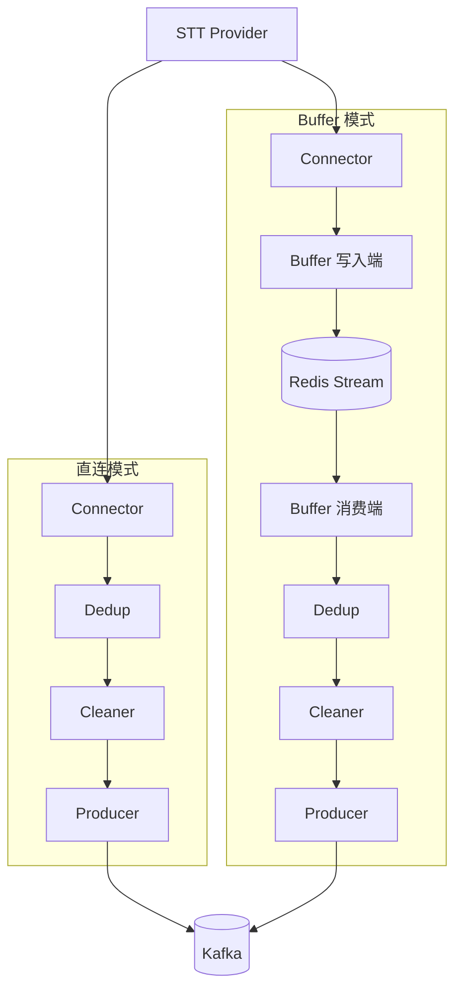

# 架构设计

本文档说明 Transcription Ingest 的架构设计、关键模块原理及异常恢复机制。

---

## 1. 角色说明

| 角色 | 代码模块 | 职责 |
|------|----------|------|
| **Connector** | connector/ | 连接 STT Provider，接收 SSE/WebSocket 推送的 JSON |
| **Buffer 写入端** | buffer/RedisBuffer | 将 Connector 收到的 payload 写入 Redis Stream |
| **Buffer 消费端** | buffer/RedisBufferConsumer | 从 Redis Stream 读取 → 去重 → 清洗 → 写入 Kafka |
| **Dedup** | dedup/ | 按 Key 去重，发送失败时撤销记录以支持重试 |
| **Cleaner** | transform/ | 数据清洗，输出 `raw` + `cleaned` |
| **Producer** | producer/ | 写入 Kafka |

> 说明：本服务只**生产** Kafka 消息，不消费 Kafka。下游业务（NLP、质检等）自行消费 Kafka。

---

## 2. 模块调用图

---

## 3. 数据流

| 模式 | 数据流 |
|------|--------|
| 直连 | STT Provider → Connector → Dedup → Cleaner → Producer → Kafka |
| Buffer | STT Provider → Connector → Buffer 写入端 → Redis Stream → Buffer 消费端 → Dedup → Cleaner → Producer → Kafka |

Buffer 模式下，数据先落 Redis Stream，再由 Buffer 消费端异步读取并写入 Kafka；服务中断或 Kafka 不可用时，消息保留在 Stream，恢复后自动重试。

---

## 4. 关键模块设计原理

### 4.1 Connector

**职责**：建立与 STT Provider 的长连接，解析推送的 JSON，按 `result.transcripts` 展开为 `TranscriptionEvent`。

**SSE vs WebSocket**：

- **SSE**：基于 HTTP GET，单向推送，支持 `Last-Event-ID` 断点续传。适合 STT Provider 以 HTTP 流式返回的场景。
- **WebSocket**：双向通道，支持 ping/pong 保活。配置 `WS_PING_INTERVAL`、`WS_PING_TIMEOUT` 控制心跳。

**断点续传**：SSE 模式下，`last_event_id` 在重连时传给 `connect_fn`，下次重连会带上 `Last-Event-ID` 请求头，STT Provider 可从该位置继续推送。

**重连策略**：由 `reconnect.run_with_reconnect` 统一管理，指数退避（`initial_delay * backoff_factor^attempt`）。

---

### 4.2 Buffer（Redis Stream）

**选型理由**：Redis Stream 支持持久化、消费组、ACK 机制，适合 Kafka 不可用时暂存消息。

**写入端**（`RedisBuffer`）：

- `XADD` 将 payload 写入 Stream，`maxlen` 可限制 Stream 长度，避免内存溢出。
- 每条消息格式：`{payload: JSON.stringify(raw)}`。

**消费端**（`RedisBufferConsumer`）：

- `XREADGROUP` 消费组消费：先读新消息（`>`），再读未 ACK 的 pending（`0`）。
- 处理成功：`XACK` + `XDEL`；失败则**不** XACK，消息保留在 Stream，下次重试。
- `block=200` 毫秒轮询，兼顾新消息与 pending。

**与 Dedup 的关系**：消费端在发送 Kafka 前做 dedup；发送失败时调用 `dedup.remove()` 撤销 dedup 记录，保证重试时能再次发送。

---

### 4.3 Dedup

**原理**：Redis `SET key "1" NX EX ttl`，key 不存在则设置成功返回 True，否则返回 False。

**Key 组成**：由 `DEDUP_KEY_PARTS` 配置，支持 `session_id`、`processing_id`、`seq_no`、`created_at` 组合，例如 `dedup:s1:p1:0`。

**TTL**：`DEDUP_TTL_SECONDS` 控制 key 过期时间。需大于「同一 transcript 可能重复到达」的最大时间间隔（如 STT 重连重放）。

**remove()**：发送 Kafka 失败时调用，删除 dedup key，使重试时 `should_emit` 再次返回 True。

---

### 4.4 Producer

**Key 设计**：使用 `session_id` 作为 Kafka 消息 Key，相同 session 落入同一分区，分区内有序。

**启动校验**：`ensure_ready()` 在启动时调用，确保 Kafka 可达，失败则退出并输出明确错误。

**发送超时**：`asyncio.wait_for(producer.send(), timeout)`，默认 10 秒。超时后抛出 `RuntimeError`，Buffer 消费端捕获后不 XACK，消息保留待重试。

**Topic 创建**：首次启动时 `AIOKafkaAdminClient.create_topics`，若 Topic 已存在则忽略异常。

---

### 4.5 Shutdown

**SIGTERM/SIGINT**：注册信号处理器，收到后设置 `draining=True`，主循环检查 `draining` 后退出。

**Windows**：`add_signal_handler` 不支持，改用 `signal.signal`。

**stop_timeout**：`wait_for_sessions_or_timeout` 等待活跃 session 结束，超时后强制退出并打日志。

---

## 5. 异常与恢复

| 场景 | 行为 | 日志 |
|------|------|------|
| Redis 不可用 | 启动时 `ping()` 失败，立即退出 | `Transcription Ingest: 启动失败（Redis 不可用）` |
| Kafka 不可用 | 启动时 `ensure_ready()` 失败，立即退出 | `Transcription Ingest: 启动失败（Kafka 不可用）` |
| Kafka 发送超时 | Buffer 消费端不 XACK，消息保留；调用 `dedup.remove()` | `Buffer Consumer: 处理消息失败（Kafka 不可用，消息已保留在 Buffer，将自动重试）` |
| STT 断连 | 重连循环按指数退避重试 | `Reconnect: 连接 STT 失败（STT 提供商服务未就绪，将自动重试）` |
| STT 502/503/504 | 同上，视为 STT 不可用 | 同上 |

---

## 6. 与下游关系

本服务只**生产** Kafka 消息，不消费 Kafka。下游业务（NLP、质检等）需自行订阅 Topic `transcription_topic` 消费。

消息格式：`{ raw: {...}, cleaned: {...} }`，其中 `cleaned` 为结构化字段（`session_id`、`seq_no`、`transcript`、`role` 等）。
