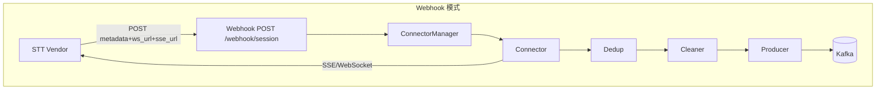
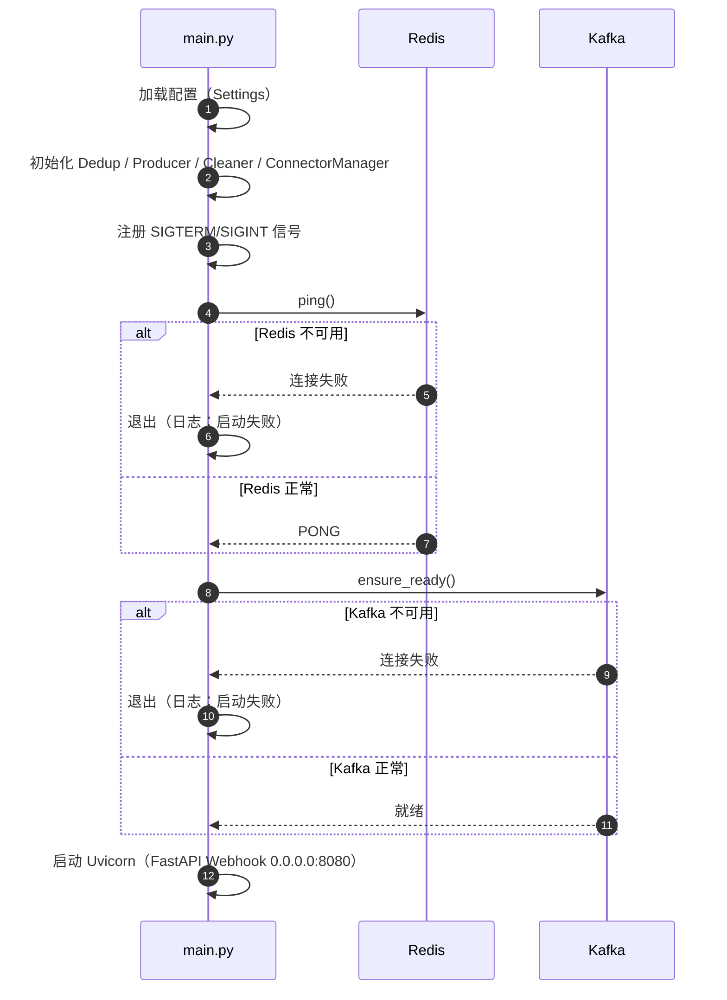
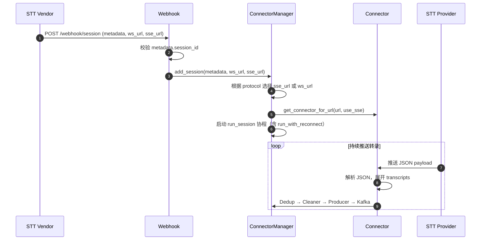

# 架构设计

本文档说明 Transcribe Service 的架构设计、关键模块原理及异常恢复机制。

---

## 1. 角色说明

| 角色 | 代码模块 | 职责 |
|------|----------|------|
| **Webhook** | webhook/ | 接收 Vendor POST，校验 session_id，调用 ConnectorManager.add_session |
| **ConnectorManager** | connector/manager.py | 管理多会话，每会话创建 Connector 并启动 run_session |
| **Connector** | connector/ | 连接 STT Provider（ws_url/sse_url），接收 SSE/WebSocket 推送的 JSON |
| **Dedup** | dedup/ | 按 Key 去重 |
| **Cleaner** | transform/ | 数据清洗，输出 `raw` + `cleaned` |
| **Producer** | producer/ | 写入 Kafka |

> 说明：本服务只**生产** Kafka 消息，不消费 Kafka。下游业务（NLP、质检等）自行消费 Kafka。

---

## 2. 模块调用图

---

## 3. 数据流

**Webhook 模式**：Vendor 推送 Webhook → Transcribe Service Webhook 接收 → ConnectorManager 建连 → Connector 连接 ws_url/sse_url → Dedup → Cleaner → Producer → Kafka

STT 连接地址（ws_url、sse_url）由 Webhook 请求体提供，每会话独立。

---

## 4. 时序图

### 4.1 启动阶段

### 4.2 Webhook 接收与会话建立

### 4.3 优雅停机

收到 SIGTERM/SIGINT 后 `GracefulShutdown` 置 `draining=True`。ConnectorManager 的 run_session 检查 `draining` 后退出循环。主流程等待活跃会话结束（或 stop_timeout 超时），设置 `server.should_exit=True`，关闭 Uvicorn。

---

## 5. 关键模块设计原理

### 5.1 Webhook

**路径**：固定 `/webhook/session`，host `0.0.0.0`，port `8080`。

**Payload**：`{ metadata: { session_id }, ws_url, sse_url }`。metadata.session_id 必填。

**响应**：202 Accepted。

### 5.2 ConnectorManager

**职责**：管理多会话，`Dict[session_id, asyncio.Task]`。add_session 创建 Connector，启动 run_session；remove_session 取消 Task。

**run_session**：connect → Dedup → Cleaner → Producer，内部复用 `run_with_reconnect` 实现断连重试。

### 5.3 Connector

**创建方式**：`get_connector_for_url(url, use_sse, last_event_id, ...)` 根据 use_sse 返回 SseConnector 或 WebSocketConnector。

**SSE vs WebSocket**：由 `TRANSCRIBE_SERVICE_PROTOCOL` 配置，Webhook 收到 ws_url/sse_url 后按此选择。

**重连策略**：由 `reconnect.run_with_reconnect` 管理。连接失败时指数退避；连接正常结束时短延迟（至多 1 秒）后重连。

### 5.4 Dedup

**原理**：Redis `SET key "1" NX EX ttl`。Key 由 `DEDUP_KEY_PARTS` 配置。

### 5.5 Producer

**Key 设计**：使用 `session_id` 作为 Kafka 消息 Key。

---

## 6. 异常与恢复

| 场景 | 行为 | 日志 |
|------|------|------|
| Redis 不可用 | 启动时 `ping()` 失败，立即退出 | `Transcribe Service: 启动失败（Redis 不可用）` |
| Kafka 不可用 | 启动时 `ensure_ready()` 失败，立即退出 | `Transcribe Service: 启动失败（Kafka 不可用）` |
| STT 断连（异常） | 重连循环按指数退避重试 | `Reconnect: 连接失败，即将重连（退让）` |
| STT 连接正常结束 | 短延迟（至多 1s）后重连 | `Reconnect: 连接已结束，即将重连` |

---

## 7. 与下游关系

本服务只**生产** Kafka 消息，不消费 Kafka。下游业务（NLP、质检等）需自行订阅 Topic `transcription_topic` 消费。

消息格式：`{ raw: {...}, cleaned: {...} }`，其中 `cleaned` 为结构化字段（`session_id`、`seq_no`、`transcript`、`role` 等）。
