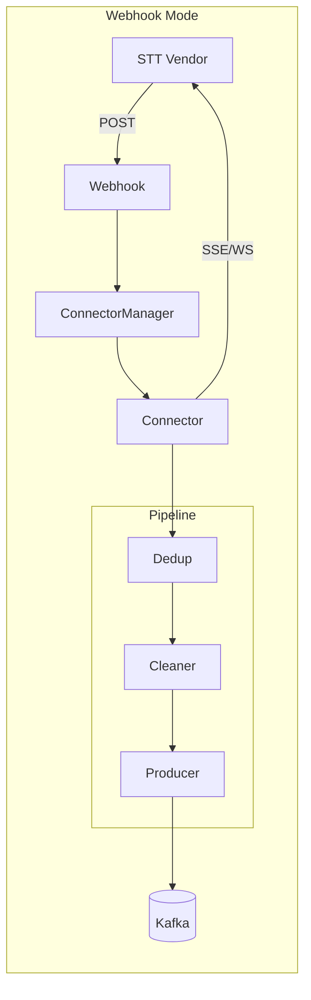
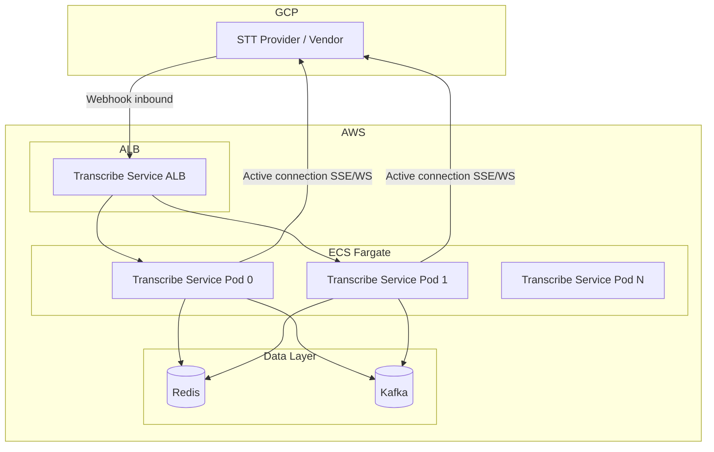
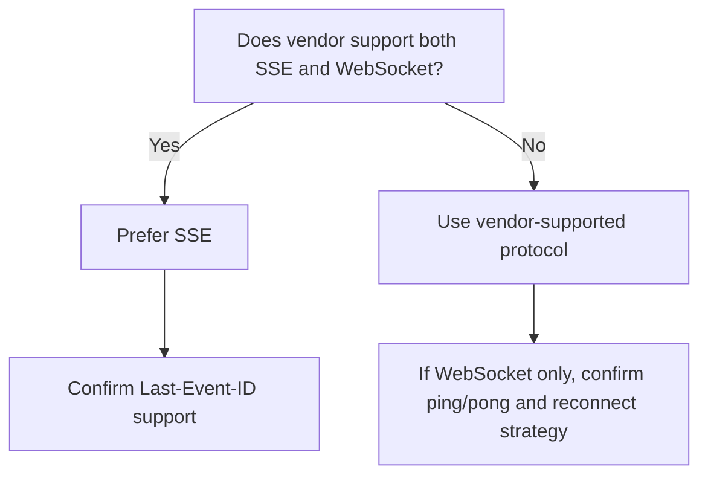
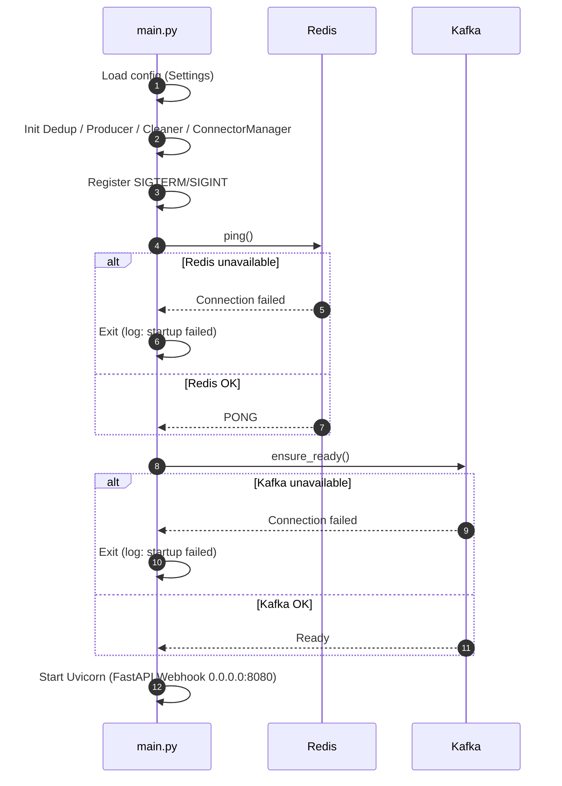
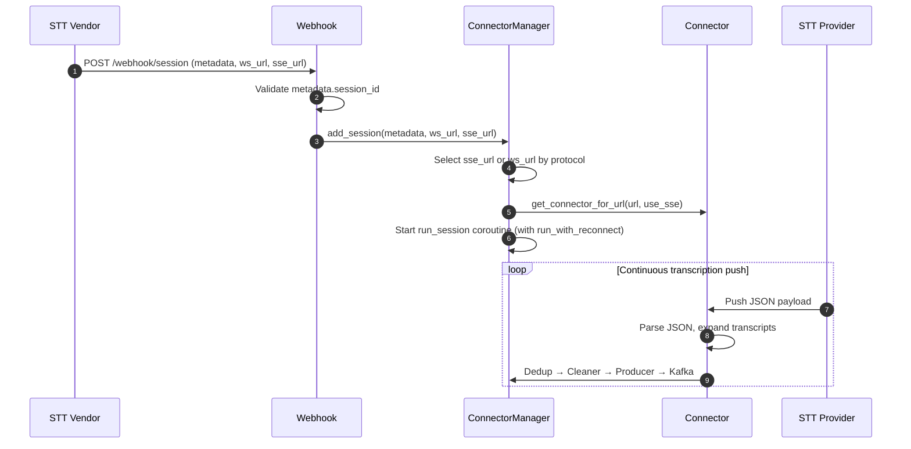

# Transcribe Service Design Overview

This document consolidates application design, infrastructure, protocol selection, and architecture for a complete view of Transcribe Service.

---

## 1. Overview

### 1.1 Project Background

Transcribe Service is a **real-time transcription ingestion and distribution service** that ingests, deduplicates, and cleans STT (Speech-to-Text) vendor output before pushing to Kafka for downstream consumers (NLP, quality assurance, etc.).

**Core Scenario**: In call center, meeting, or customer service scenarios, STT Vendors stream real-time transcriptions. This service acts as a middleware layer: it receives Vendor Webhook session notifications, actively connects to Vendor-provided SSE/WebSocket streams, and writes standardized data to Kafka for downstream decoupling.

**Design Scope**: This service only **produces** Kafka messages; it does not consume. Downstream systems must subscribe to consume. Integration scope covers STT Vendor only; call center routing is out of scope.

**Deployment Environment**: **STT Provider (Vendor) is deployed on GCP**; **Transcribe Service is deployed on AWS**. Cross-cloud communication: Vendor sends Webhooks to AWS ALB over the public internet; Transcribe Service actively connects from AWS to STT streams (ws_url/sse_url) on GCP. Network and security design must account for cross-cloud access.

### 1.2 Goals

| Dimension | Goal | Description |
|-----------|------|--------------|
| **Capacity** | 600 concurrent sessions | Typical call center/meeting scenarios; ~50 sessions per Pod (12 Pods), 20% headroom |
| **Elasticity** | 6–12 Pod horizontal scaling | Auto-scale by active sessions or CPU utilization |
| **Ordering** | Strict seq_no ordering | Per-session messages written to Kafka in seq_no order for correct downstream consumption |
| **Reliability** | Reconnect on disconnect, graceful shutdown | Exponential backoff on connection failure; wait for sessions to finish on SIGTERM before exit |
| **Decoupling** | Unified ingestion, standardized output | Mask vendor differences; output unified `{raw, cleaned}` format |

---

## 2. Architecture Overview

### 2.1 Application Architecture



---

### 2.2 Deployment Topology



**Note**: STT Provider is deployed on **GCP**; Transcribe Service, Redis, and Kafka are on **AWS**. Vendor sends Webhooks to AWS ALB over the public internet; Transcribe Service actively connects from AWS to STT streams on GCP.

---

## 3. Data Flow and Modules

### 3.1 Data Flow

```
Vendor Webhook → ConnectorManager → Connector → Dedup → Cleaner → Producer → Kafka
```

### 3.2 Roles and Modules

| Role | Code Module | Responsibility | Key Classes/Functions |
|------|-------------|----------------|----------------------|
| **Webhook** | webhook/ | Receive Vendor POST, validate session_id, call ConnectorManager.add_session | `POST /webhook/session` |
| **ConnectorManager** | connector/manager.py | Manage multi-session; create Connector per session, run run_session | `add_session(metadata, ws_url, sse_url)` |
| **Connector** | connector/ | Connect to STT Provider (ws_url/sse_url), receive SSE/WebSocket JSON | `get_connector_for_url`, SseConnector, WebSocketConnector |
| **Dedup** | dedup/ | Deduplicate by key | [transcription_ingest/dedup/](../src/transcription_ingest/dedup/) |
| **Cleaner** | transform/ | Data cleaning; output `raw` + `cleaned` | [transcription_ingest/transform/](../src/transcription_ingest/transform/) |
| **Producer** | producer/ | Write to Kafka, key=session_id | [transcription_ingest/producer/](../src/transcription_ingest/producer/) |

> This service only **produces** Kafka messages; it does not consume. Downstream systems (NLP, QA, etc.) consume independently.

---

## 4. Protocol Choice (SSE vs WebSocket)

### 4.1 Comparison

| Dimension | SSE | WebSocket |
|-----------|-----|-----------|
| Direction | Server→Client | Bidirectional |
| Protocol | HTTP, Last-Event-ID for resumption | Separate protocol, app-layer handling |
| Proxy/Firewall | Good compatibility | Some proxies may restrict |
| Complexity | Simple (httpx streaming) | Requires ping/pong, frame handling |
| Vendor Support | Common | Common |

### 4.2 Recommendation

**Recommendation: SSE**

**Reasons**:

1. **Unidirectional**: Transcription is server→client; no client→server messages needed
2. **Resumption**: SSE supports `Last-Event-ID` natively for seamless reconnect
3. **Simplicity**: SSE is HTTP-based; standard HTTP libraries suffice for streaming
4. **Compatibility**: HTTP protocol, better proxy/firewall compatibility

### 4.3 Selection Flow



---

## 5. Infrastructure

### 5.1 Deployment Environment

| Component | Cloud | Description |
|-----------|-------|--------------|
| **STT Provider (Vendor)** | GCP | Webhook notifications and SSE/WebSocket transcription streams |
| **Transcribe Service** | AWS | Runs on ECS Fargate; receives Webhook, connects STT streams, writes to Kafka |
| **Redis, Kafka** | AWS | Data layer; same VPC as Transcribe Service |

Cross-cloud connectivity must ensure: GCP → AWS (Webhook inbound), AWS → GCP (active connection to STT streams).

### 5.2 ECS Fargate Design

- **Transcribe Service**: 6–12 tasks, 1 container per task
- **Resource sizing**: CPU/Memory for ~100 sessions per task
- **Scaling**: Auto-scale by active sessions or CPU utilization
- **Task definition**: Container image, env vars (Redis URL, Kafka address, etc.), health checks (HTTP probe to `/health` or `/ready`)

### 5.3 Network and Security

| Direction | Description |
|-----------|--------------|
| **Inbound** | Transcribe Service (AWS) exposes Webhook HTTP endpoint for Vendor (GCP); via ALB + security groups; HTTPS recommended |
| **Outbound** | Transcribe Service (AWS) must reach STT Provider (GCP) on public internet or dedicated link for ws_url/sse_url |
| **Data Layer** | Redis, Kafka in AWS VPC; Transcribe Service accesses via security groups |

For cross-cloud, ensure firewalls and security groups allow GCP ↔ AWS traffic; consider dedicated link/VPN to reduce latency and jitter.

---

## 6. Key Module Design

### 6.1 Webhook

- **Path**: Fixed `/webhook/session`, host `0.0.0.0`, port `8080`
- **Payload**: `{ metadata: { session_id }, ws_url, sse_url }`. metadata.session_id required
- **Response**: 202 Accepted
- **Authentication**: Recommend HTTPS + HMAC-SHA256 signature (see [vendor-interface-confirmation.en.md](vendor-interface-confirmation.en.md) Section 5)

### 6.2 ConnectorManager

- **Responsibility**: Manage multi-session; `Dict[session_id, asyncio.Task]`. add_session creates Connector, starts run_session; remove_session cancels Task
- **run_session**: connect → Dedup → Cleaner → Producer; uses `run_with_reconnect` for retry on disconnect

### 6.3 Connector

- **Creation**: `get_connector_for_url(url, use_sse, last_event_id, ...)` returns SseConnector or WebSocketConnector based on use_sse
- **SSE vs WebSocket**: Configured via `TRANSCRIBE_SERVICE_PROTOCOL`
- **Reconnect**: Managed by `reconnect.run_with_reconnect`. Exponential backoff on failure; short delay (≤1s) on normal end

### 6.4 Dedup

- **Mechanism**: Redis `SET key "1" NX EX ttl`. Key configured by `DEDUP_KEY_PARTS`

### 6.5 Producer

- **Key design**: Use `session_id` as Kafka message key

---

## 7. Lifecycle and Sequence

### 7.1 Startup



### 7.2 Webhook Reception and SSE/WS Connection Establishment



### 7.3 Graceful Shutdown

On SIGTERM/SIGINT, `GracefulShutdown` sets `draining=True`. ConnectorManager run_session checks `draining` and exits loop. Main flow waits for active sessions to finish (or stop_timeout), then sets `server.should_exit=True` and closes Uvicorn.

---

## 8. Failures and Recovery

| Scenario | Behavior | Log |
|----------|-----------|-----|
| Redis unavailable | ping() fails at startup, exit immediately | `Transcribe Service: startup failed (Redis unavailable)` |
| Kafka unavailable | ensure_ready() fails at startup, exit immediately | `Transcribe Service: startup failed (Kafka unavailable)` |
| STT disconnect (error) | Reconnect loop with exponential backoff | `Reconnect: connection failed, retrying (backoff)` |
| STT normal end | Short delay (≤1s) then reconnect | `Reconnect: connection ended, retrying` |

---

## 9. Downstream Relationship

This service only **produces** Kafka messages; it does not consume. Downstream systems (NLP, QA, etc.) must subscribe to Topic `transcription_topic` to consume.

**Message format**: `{ raw: {...}, cleaned: {...} }`, where `cleaned` contains structured fields (`session_id`, `seq_no`, `transcript`, `role`, etc.).

---

## 10. Configuration Summary

Key config (see [configuration.md](configuration.md)):

| Config | Description | Example |
|--------|--------------|---------|
| `transcribe_service_max_sessions_per_pod` | Max sessions per Pod | 100 |
| `transcribe_service_protocol` | Protocol: `sse` or `websocket` | sse |
| `redis_url` | Redis URL | redis://localhost:6379/0 |
| `kafka_bootstrap_servers` | Kafka bootstrap | localhost:9092 |
| `kafka_topic` | Topic name | transcription_topic |
| `stop_timeout` | Graceful shutdown timeout (seconds) | 120 |

---

## 11. Related Documents

- [vendor-interface-confirmation.en.md](vendor-interface-confirmation.en.md) - Vendor interface confirmation
- [configuration.md](configuration.md) - Configuration
- [deployment.md](deployment.md) - Deployment guide

---

*This document consolidates specs/01-application-design.md, specs/02-infrastructure-design.md, specs/03-websocket-vs-sse-choice.md, and architecture.md. See original docs for details.*
