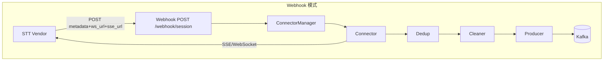
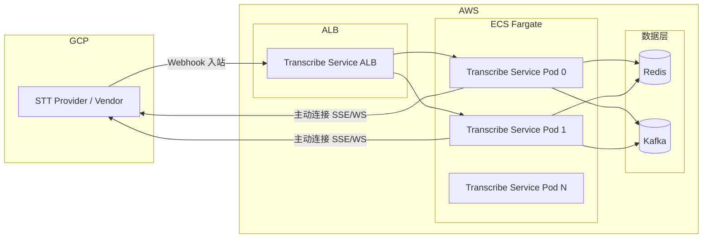
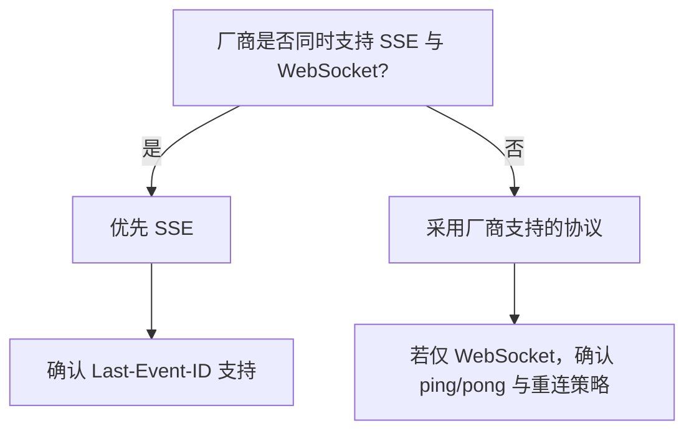
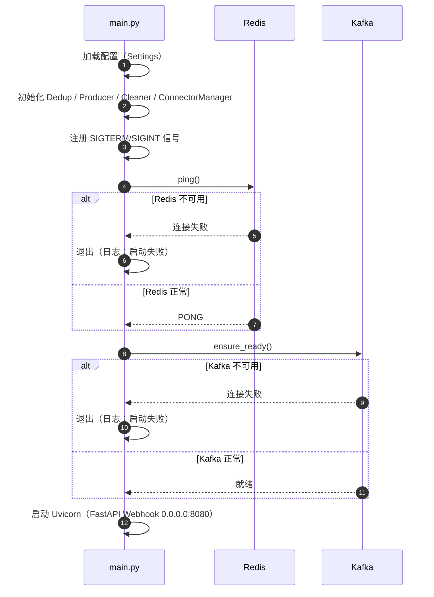
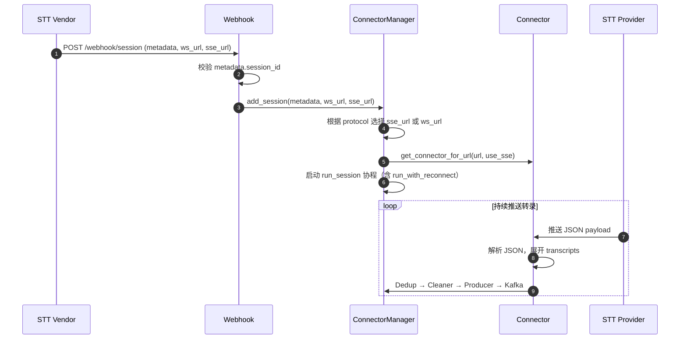

# Transcribe Service 设计总览

本文档整合应用设计、基础设施、协议选择及架构设计，提供 Transcribe Service 的完整设计视图。

---

## 1. 概述

### 1.1 项目背景

Transcribe Service 是**实时转录接入与分发服务**，负责将 STT（语音转文字）厂商的转录结果统一接入、去重、清洗后推送到 Kafka，供下游业务（NLP、质检等）消费。

**核心场景**：呼叫中心、会议、客服等场景中，STT Vendor 实时输出转录流；本服务作为中间层，接收 Vendor 的 Webhook 会话通知，主动连接 Vendor 提供的 SSE/WebSocket 流，将转录数据标准化后写入 Kafka，实现与下游系统的解耦。

**设计定位**：本服务只**生产** Kafka 消息，不消费；下游业务需自行订阅 Topic 消费。对接范围仅考虑 STT Vendor，不涉及呼叫中心路由。

**部署环境**：**STT Provider（Vendor）部署在 GCP**，**Transcribe Service 部署在 AWS**。两者跨云通信：Vendor 通过公网向 AWS ALB 发送 Webhook；Transcribe Service 从 AWS 主动连接 GCP 上的 STT 流（ws_url/sse_url）。网络与安全设计需考虑跨云访问。

### 1.2 目标


| 维度      | 目标            | 说明                                                    |
| ------- | ------------- | ----------------------------------------------------- |
| **容量**  | 600 并发会话      | 满足典型呼叫中心/会议场景的并发转录需求；每 Pod 约 50 会话（12 Pod），预留 20% 余量  |
| **弹性**  | 6–12 Pod 水平扩展 | 按活跃会话数或 CPU 利用率自动扩缩，支持流量波动                            |
| **顺序**  | 严格 seq_no 顺序  | 单会话内转录消息按 seq_no 有序写入 Kafka，保证下游消费顺序正确                |
| **可靠性** | 断连重试、优雅停机     | 连接失败时指数退避重连；收到 SIGTERM 后等待会话结束再退出，避免数据丢失              |
| **解耦**  | 统一接入、标准化输出    | 屏蔽多 Vendor 差异，输出统一的 `{raw, cleaned}` 格式，下游无需关心 STT 来源 |


---

## 2. 架构总览

### 2.1 应用架构




### 2.2 部署拓扑




**说明**：STT Provider 部署在 **GCP**，Transcribe Service 及 Redis、Kafka 部署在 **AWS**。Vendor 通过公网向 AWS ALB 发送 Webhook；Transcribe Service 从 AWS 主动连接 GCP 上的 STT 流。

---

## 3. 数据流与模块

### 3.1 数据流

```
Vendor Webhook → ConnectorManager → Connector → Dedup → Cleaner → Producer → Kafka
```

### 3.2 角色与模块


| 角色                   | 代码模块                 | 职责                                                           | 关键类/函数                                                                    |
| -------------------- | -------------------- | ------------------------------------------------------------ | ------------------------------------------------------------------------- |
| **Webhook**          | webhook/             | 接收 Vendor POST，校验 session_id，调用 ConnectorManager.add_session | `POST /webhook/session`                                                   |
| **ConnectorManager** | connector/manager.py | 管理多会话，每会话创建 Connector 并启动 run_session                        | `add_session(metadata, ws_url, sse_url)`                                  |
| **Connector**        | connector/           | 连接 STT Provider（ws_url/sse_url），接收 SSE/WebSocket 推送的 JSON    | `get_connector_for_url`, SseConnector, WebSocketConnector                 |
| **Dedup**            | dedup/               | 按 Key 去重                                                     | [transcription_ingest/dedup/](../src/transcription_ingest/dedup/)         |
| **Cleaner**          | transform/           | 数据清洗，输出 `raw` + `cleaned`                                    | [transcription_ingest/transform/](../src/transcription_ingest/transform/) |
| **Producer**         | producer/            | 写入 Kafka，key=session_id                                      | [transcription_ingest/producer/](../src/transcription_ingest/producer/)   |


> 本服务只**生产** Kafka 消息，不消费 Kafka。下游业务（NLP、质检等）自行消费 Kafka。

---

## 4. 协议选择（SSE vs WebSocket）

### 4.1 对比矩阵


| 维度     | SSE                     | WebSocket       |
| ------ | ----------------------- | --------------- |
| 方向     | 服务端→客户端                 | 双向              |
| 协议     | HTTP，Last-Event-ID 断点续传 | 独立协议，需应用层实现     |
| 代理/防火墙 | 兼容性好                    | 部分代理可能限制        |
| 实现复杂度  | 简单（httpx 流式）            | 需 ping/pong、帧处理 |
| 厂商支持   | 常见                      | 常见              |


### 4.2 决策结论

**推荐：SSE**

**理由**：

1. **单向推送**：转录场景为服务端→客户端单向推送，无需客户端→服务端消息
2. **断点续传**：SSE 原生支持 `Last-Event-ID`，断线重连可无缝续传
3. **实现简单**：SSE 构建于 HTTP 协议之上，实现时只需标准 HTTP 库即可支持流式数据读取，无需管理底层 socket、帧解析或心跳机制，且不要求开发额外的协议解析、连接保活逻辑，错误处理和重连流程也更为直接。
4. **兼容性**：HTTP 协议，代理/防火墙兼容性更好

### 4.3 选择流程




---

## 5. 基础设施

### 5.1 部署环境说明


| 组件                       | 云平台 | 说明                                          |
| ------------------------ | --- | ------------------------------------------- |
| **STT Provider（Vendor）** | GCP | 提供 Webhook 通知及 SSE/WebSocket 转录流            |
| **Transcribe Service**   | AWS | ECS Fargate 运行，接收 Webhook、连接 STT 流、写入 Kafka |
| **Redis、Kafka**          | AWS | 数据层，与 Transcribe Service 同 VPC              |


跨云通信需确保：GCP → AWS（Webhook 入站）、AWS → GCP（主动连接 STT 流）的网络可达性与安全策略。

### 5.2 ECS Fargate 设计

- **Transcribe Service 服务**：6–12 任务，每任务 1 容器
- **资源估算**：CPU/Memory 按 100 会话/任务估算
- **扩缩容**：按活跃会话数或 CPU 利用率自动扩缩
- **任务定义**：容器镜像、环境变量（Redis URL、Kafka 地址等）、健康检查（HTTP 探针指向 `/health` 或 `/ready`）

### 5.3 网络与安全


| 方向      | 说明                                                                                 |
| ------- | ---------------------------------------------------------------------------------- |
| **入站**  | Transcribe Service（AWS）暴露 Webhook HTTP 端点，供 GCP 上的 Vendor 调用；通过 ALB + 安全组；建议 HTTPS |
| **出站**  | Transcribe Service（AWS）需可访问 GCP 上的 STT Provider（公网或专线互联），用于连接 ws_url/sse_url       |
| **数据层** | Redis、Kafka 置于 AWS VPC 内，Transcribe Service 通过安全组访问                                |


跨云场景下，需确保防火墙、安全组允许 GCP ↔ AWS 的互通流量；建议评估专线/VPN 以降低公网延迟与抖动。

---

## 6. 关键模块设计原理

### 6.1 Webhook

- **路径**：固定 `/webhook/session`，host `0.0.0.0`，port `8080`
- **Payload**：`{ metadata: { session_id }, ws_url, sse_url }`。metadata.session_id 必填
- **响应**：202 Accepted
- **认证**：建议使用 HTTPS + HMAC-SHA256 签名（见 [vendor-interface-confirmation.md](vendor-interface-confirmation.md) 第 5 节）

### 6.2 ConnectorManager

- **职责**：管理多会话，`Dict[session_id, asyncio.Task]`。add_session 创建 Connector，启动 run_session；remove_session 取消 Task
- **run_session**：connect → Dedup → Cleaner → Producer，内部复用 `run_with_reconnect` 实现断连重试

### 6.3 Connector

- **创建方式**：`get_connector_for_url(url, use_sse, last_event_id, ...)` 根据 use_sse 返回 SseConnector 或 WebSocketConnector
- **SSE vs WebSocket**：由 `TRANSCRIBE_SERVICE_PROTOCOL` 配置
- **重连策略**：由 `reconnect.run_with_reconnect` 管理。连接失败时指数退避；连接正常结束时短延迟（至多 1 秒）后重连

### 6.4 Dedup

- **原理**：Redis `SET key "1" NX EX ttl`。Key 由 `DEDUP_KEY_PARTS` 配置

### 6.5 Producer

- **Key 设计**：使用 `session_id` 作为 Kafka 消息 Key

---

## 7. 生命周期与时序

### 7.1 启动阶段




### 7.2 Webhook 接收与会话建立




### 7.3 优雅停机

收到 SIGTERM/SIGINT 后 `GracefulShutdown` 置 `draining=True`。ConnectorManager 的 run_session 检查 `draining` 后退出循环。主流程等待活跃会话结束（或 stop_timeout 超时），设置 `server.should_exit=True`，关闭 Uvicorn。

---

## 8. 异常与恢复


| 场景         | 行为                           | 日志                                    |
| ---------- | ---------------------------- | ------------------------------------- |
| Redis 不可用  | 启动时 `ping()` 失败，立即退出         | `Transcribe Service: 启动失败（Redis 不可用）` |
| Kafka 不可用  | 启动时 `ensure_ready()` 失败，立即退出 | `Transcribe Service: 启动失败（Kafka 不可用）` |
| STT 断连（异常） | 重连循环按指数退避重试                  | `Reconnect: 连接失败，即将重连（退让）`            |
| STT 连接正常结束 | 短延迟（至多 1s）后重连                | `Reconnect: 连接已结束，即将重连`               |


---

## 9. 与下游关系

本服务只**生产** Kafka 消息，不消费 Kafka。下游业务（NLP、质检等）需自行订阅 Topic `transcription_topic` 消费。

**消息格式**：`{ raw: {...}, cleaned: {...} }`，其中 `cleaned` 为结构化字段（`session_id`、`seq_no`、`transcript`、`role` 等）。

---

## 10. 配置要点

关键配置项（详见 [configuration.md](configuration.md)）：


| 配置项                                       | 说明                     | 示例                       |
| ----------------------------------------- | ---------------------- | ------------------------ |
| `transcribe_service_max_sessions_per_pod` | 每 Pod 最大会话数            | 100                      |
| `transcribe_service_protocol`             | 协议：`sse` 或 `websocket` | sse                      |
| `redis_url`                               | Redis 连接地址             | redis://localhost:6379/0 |
| `kafka_bootstrap_servers`                 | Kafka 集群地址             | localhost:9092           |
| `kafka_topic`                             | Topic 名称               | transcription_topic      |
| `stop_timeout`                            | 优雅停机超时（秒）              | 120                      |


---

## 11. 相关文档

- [vendor-interface-confirmation.md](vendor-interface-confirmation.md) - Vendor 接口确认

---

*本文档整合自 specs/01-application-design.md、specs/02-infrastructure-design.md、specs/03-websocket-vs-sse-choice.md 及 architecture.md，详细可参考原文档。*