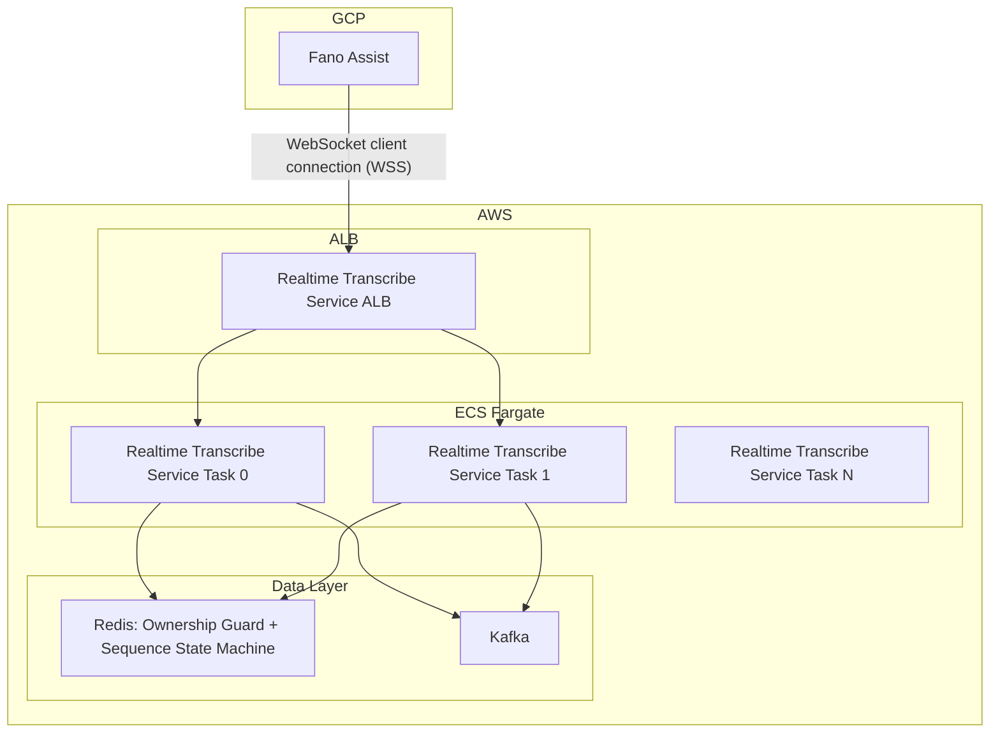
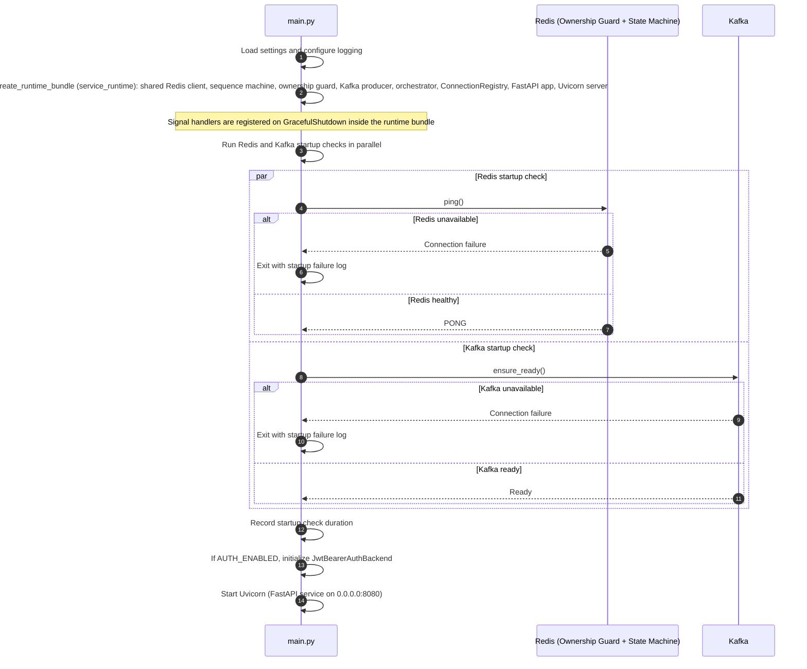
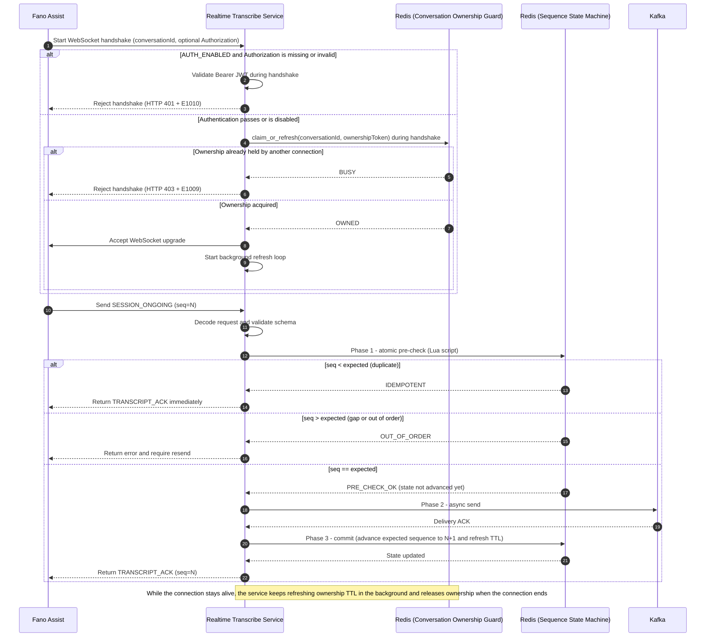
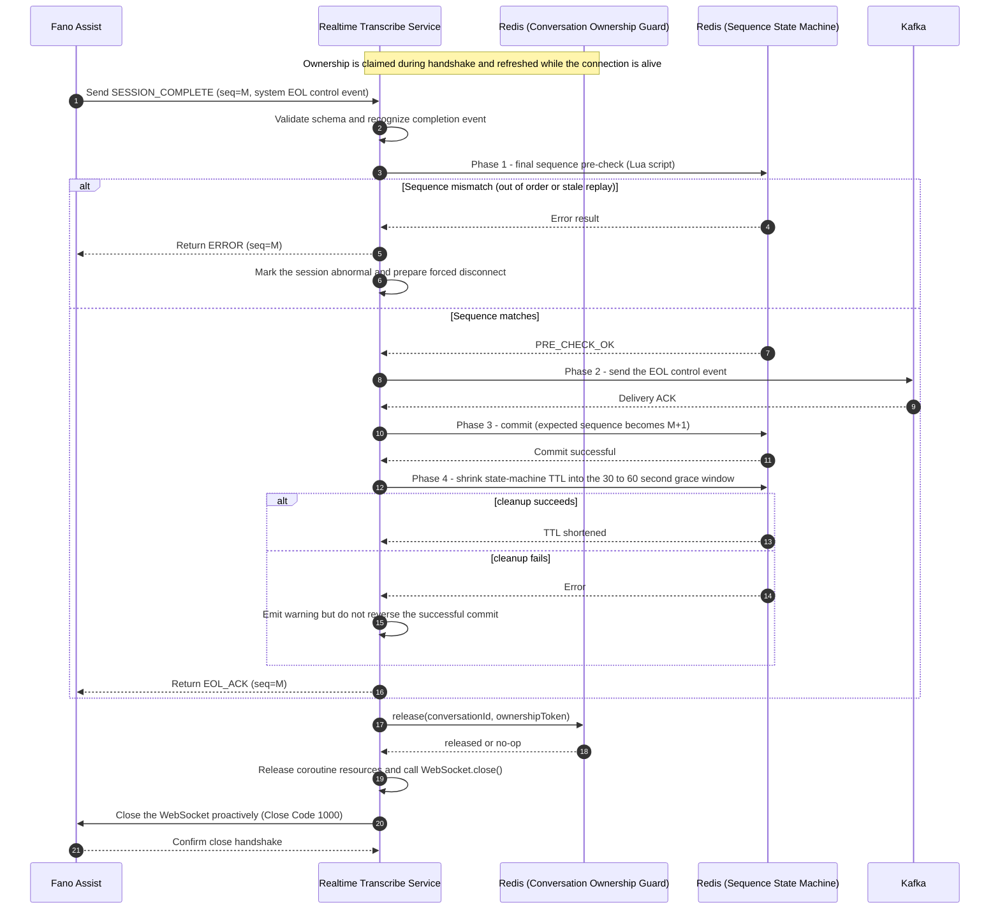
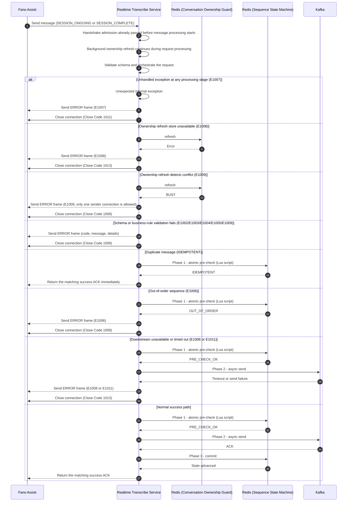
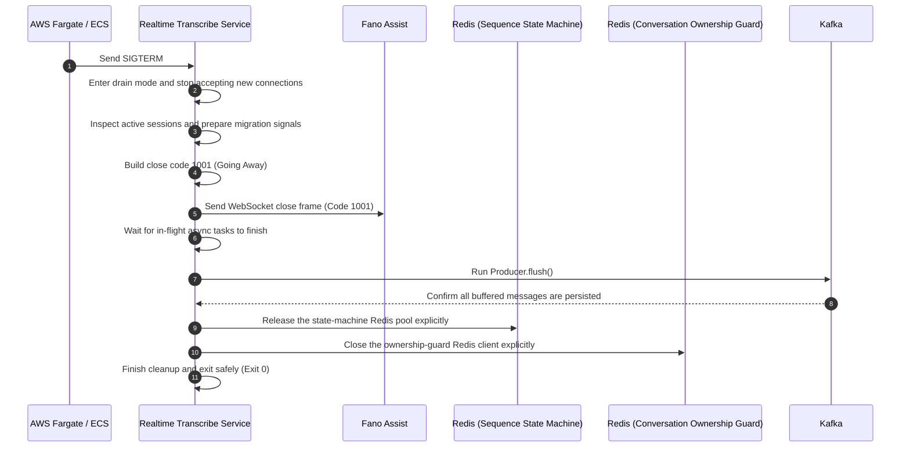

# Realtime Transcribe Service Architecture Overview

---

## 1. Design Overview

### 1.1 Business Context

As the contact center platform evolves toward real-time AI assistance, Fano Assist acts as the client of the ASR engine. The engine itself is hosted and operated by the bank in its GCP environment.

**Realtime Transcribe Service** runs in the bank's AWS environment and serves as the real-time data gateway between the upstream transcription stream in GCP and the downstream data ecosystem in AWS.

### 1.2 Business Objectives

| Objective | Target |
| --- | --- |
| **Concurrent sessions** | 700 to 1,000 simultaneous calls during the morning peak (design target) |
| **End-to-end latency** | TBC, measured from GCP ingress to AWS Kafka |
| **Data integrity** | Strict ordering with zero data loss |

### 1.3 Scope Boundaries

| Category | Scope |
| --- | --- |
| **In scope** | Long-lived cross-cloud connection management; ordering enforcement based on `conversationId` and `sequenceNumber`; reliable delivery to Kafka |
| **Out of scope** | Audio streaming; business features such as intent recognition or sentiment analysis; downstream consumption logic, which is handled by Kafka consumers |

### 1.4 Architecture Highlights

- **Connection model**: Fano Assist acts as the WebSocket client and initiates the connection to Realtime Transcribe Service.
- **Ordering control**: Redis Conversation Ownership Guard plus Redis Sequence State Machine, backed by a two-phase commit flow.
- **Data path**: Fano Assist -> Realtime Transcribe Service -> Kafka. Downstream systems consume through Kafka consumer groups.

---

## 2. Architecture Overview

### 2.1 Deployment Topology

### 2.2 Core Sequence Diagrams

#### 2.2.1 Startup Sequence

#### 2.2.2 Main Processing Flow: Two-Phase Commit (`SESSION_ONGOING`)

#### 2.2.3 `SESSION_COMPLETE` and Connection Release

> The protocol identifies `SESSION_COMPLETE` by `eventType=SESSION_COMPLETE` together with `payload.speaker=System`. In examples, `payload.transcript` is often `"EOL"`, but the server does not enforce a fixed literal.

#### 2.2.4 Exception Handling and Error Response

When validation fails or a downstream dependency becomes unavailable, Realtime Transcribe Service sends an `ERROR` frame first and then closes the WebSocket according to policy. See [API Contract Section 4](api-contract.md#4-status-codes-and-error-codes) for the error-code and close-code mapping.

#### 2.2.5 Graceful Shutdown Sequence

---

## 3. Core Design

### 3.1 Modules and Responsibilities

The application follows a dependency-inversion architecture. The orchestrator sits at the center, while network I/O, protocol validation, and storage integrations are isolated behind interface contracts.

| Module | Primary Responsibility | Allowed Core Actions | Architectural No-Go Zone |
| --- | --- | --- | --- |
| `main.py` | Process entrypoint and shutdown orchestration | Load settings; configure logging; `create_runtime_bundle`; parallel Redis/Kafka startup checks; run Uvicorn; on exit, `close_all` + `flush` then `close_runtime_bundle` | No dependency graph assembly details; no per-message JSON parsing |
| `service_runtime.py` | `RuntimeBundle` assembly and teardown | `create_runtime_bundle`, `build_web_app`, `create_uvicorn_server`, `close_runtime_bundle` | No WebSocket message loop; no orchestrator business rules beyond wiring |
| `config/` | Environment-backed settings and logging bootstrap | Load and validate `Settings` (Pydantic Settings / `.env`); derive local defaults vs. deployed required keys; configure structlog and stdlib logging (`LOG_LEVEL`, `LOG_FORMAT`) | No WebSocket or protocol handling; no Redis, Kafka, or orchestration calls |
| `auth/` | Handshake authentication boundary | Validate `Authorization: Bearer <JWT>` during handshake and expose the authenticated subject to the transport scope; `auth/runtime.py` builds the backend from settings | No ownership claims, no sequence advancement, and no Kafka/orchestrator calls |
| `schemas/` | Protocol contract and validation layer | Validate fields, types, timestamps, and business rules; build standard responses; `error_codes.py` / `error_scenarios.py` map contract codes to HTTP/WS close behavior | No network I/O and no data-store calls |
| `converter/` | Kafka outbound conversion layer | Build `KafkaOutboundMessage` from validated `InboundMessage`, set `enrich.eventProduceTimestamp` immediately before `producer.send`, and validate outbound schema | Must not perform network I/O or mutate caller input |
| `utils/` | Shared utility helpers | Provide reusable pure helpers such as canonical UTC timestamp formatting | No business orchestration and no network/data-store I/O |
| `transport/` | WebSocket ingress layer | `app.py`: handshake admission ASGI middleware and `create_app` factory; `session.py`: per-connection receive loop, schema/consistency checks, ERROR frames and close codes; `registry.py`: active sockets; `metrics.py`: runtime counters | No embedded two-phase commit or Redis/Kafka logic beyond delegating to the orchestrator and shared backends |
| `redis/ownership_guard.py` | Conversation ownership control | Claim, refresh, and release send ownership for a conversation | No sequence advancement, field validation, or message delivery |
| `redis/runtime.py` | Redis client and guard factories | Shared async Redis client, `create_sequence_state_machine`, `create_ownership_guard`, ordered `close_redis_runtime` | No WebSocket or Kafka calls |
| `redis/sequence_state_machine.py` | Sequence state machine | Atomic Lua pre-check and state advancement; manage active and final TTL | No Kafka awareness and no downstream business logic |
| `producer/` | Kafka delivery layer | Async send, partition routing, and send-timeout handling; `producer/runtime.py` builds the producer from settings | Must not mutate the original message payload |
| `orchestrator/` | Two-phase commit orchestration | Call state pre-check, invoke Kafka send, commit state, and return ACK | Depends only on `protocols.py` abstractions, not concrete implementations |

### 3.2 Technology Stack and Concurrency Model

| Component | Choice |
| --- | --- |
| **Framework** | FastAPI (ASGI) + Uvicorn |
| **Async ecosystem** | `redis.asyncio`, `aiokafka` |
| **Concurrency model** | Single-threaded asyncio, one worker per vCPU |
| **WebSocket library** | `websockets` |

**Why this stack**: the workload is I/O-bound and latency-sensitive. Asyncio avoids unnecessary GIL contention and context-switch overhead, while one process per vCPU keeps horizontal scaling straightforward.

### 3.3 Connection Lifecycle and Keepalive

The handshake query parameter `conversationId` is the connection-level session identifier. Redis Conversation Ownership Guard enforces the rule that only one connection may actively send data for a conversation at any time.

| Mechanism | Design |
| --- | --- |
| **Connection identity** | The handshake query `conversationId` is the unique connection-level identifier. If `metaData.conversationId` is provided as a string in the message body, it must match the handshake value |
| **Handshake authentication** | When `AUTH_ENABLED=true`, the service validates `Authorization: Bearer <JWT>` before shutdown admission or ownership claim. Missing, malformed, invalid, or expired credentials reject the handshake with HTTP `401` + `E1010` |
| **Ownership acquisition** | During the handshake, the service calls `claim_or_refresh(conversationId, ownershipToken)` before accepting the WebSocket upgrade |
| **Conflict handling** | If ownership is already held by another connection, the service rejects the handshake immediately with HTTP `403` and `E1009`; the request never reaches the orchestrator |
| **Liveness during the session** | After the connection is established, a background task keeps refreshing the ownership TTL. If refresh detects a conflict or the backing store becomes unavailable, the service sends `ERROR` and closes the connection |
| **Release timing** | Ownership is released on successful `SESSION_COMPLETE`, client disconnect, or server-side teardown after an abnormal end |
| **Business events** | `SESSION_ONGOING` and `SESSION_COMPLETE` (the final EOL control event) |
| **Protocol keepalive** | Server sends WebSocket Ping every `ping_interval` (default 20s; first Ping after connection uptime reaches that interval); client must Pong within `ping_timeout` (default 10s) per Ping—see API Contract §1.4. Keeps traffic below typical ALB 60-second idle timeout |

### 3.4 Redis as the Session Control Plane

All control state is held in Redis; there is no local in-memory session state. Redis responsibilities are split into two layers:

| Redis Component | Scope | Core Responsibility | Key Operations | Explicitly Not Responsible For |
| --- | --- | --- | --- | --- |
| **Conversation Ownership Guard** | Connection level | Guarantee that only one active sender owns a given `conversationId` at a time | `claim_or_refresh`, `refresh`, `release` | Sequence advancement, Kafka delivery, or business-field validation |
| **Sequence State Machine** | Message level | Guarantee that `sequenceNumber` advances exactly as expected and manage active and final TTL | `prepare`, `commit`, `cleanup` | Deciding who owns the send connection |

Ownership Guard answers **who is allowed to send**, while Sequence State Machine answers **whether the next message is the correct one to send**. Together they form the Redis control plane for the session.

The table below describes the message-level advancement semantics of the **Sequence State Machine**, implemented with atomic Lua scripts.

#### 3.4.1 Pessimistic Locking (`SET NX`) vs. Optimistic Sequencing (Lua + Sequence)

##### 3.4.1.1 Pessimistic Locking

**Core idea**: serialize access through a lock. Only the worker that acquires the lock may proceed, and all others wait until the lock is released.

**Pros**

- Strong consistency: only one worker can process the call at a time.
- Simple success path once the lock is acquired: no sequence replay logic is needed.

**Cons**

- Latency overhead: every 200 ms audio-derived transcript slice would require lock, process, unlock.
- Lock risk: if a worker stalls after acquiring the lock, the transcription flow can be blocked until the lock expires or is cleaned up.
- Poor fit for real-time traffic: queueing delays accumulate under load and hurt live-call responsiveness.

##### 3.4.1.2 Optimistic Sequencing

**Core idea**: let processing stay concurrent, and decide validity at commit time by comparing sequence numbers. Late or stale messages are rejected by policy.

**Pros**

- Very low latency: no blocking queue, only an atomic Lua validation step.
- High throughput: ideal for frequent writes where the critical check is a numeric comparison.
- Natural deduplication: duplicate or late packets are filtered by `sequenceNumber`.

**Cons**

- Intentional rejection of stale data: a late message can be dropped in order to preserve sequence correctness.
- The client contract is slightly stricter: resend and compensation behavior must follow the protocol rules.

| Dimension | Pessimistic Locking (`SET NX`) | Optimistic Sequencing (Lua + Sequence) | Design Choice |
| --- | --- | --- | --- |
| Conflict model | Treat every conflict as blocking | Allow invalid attempts to fail fast | **Optimistic sequencing** |
| Response-time target | Can tolerate queueing | Extremely latency-sensitive | **Optimistic sequencing** |
| Operational risk | Lock cleanup and deadlock handling | Replay, duplicate, and out-of-order control | **Optimistic sequencing** |
| Primary concern | Absolute serialized access | Ordering and deduplication | **Optimistic sequencing** |

### 3.5 Two-Phase Commit

The system does not rely on a distributed transaction manager. Instead, it achieves consistency by delaying state advancement until Kafka confirms persistence.

1. **Prepare**: Fano Assist sends `seq=5`. Realtime Transcribe Service runs the Lua pre-check.
2. **Persistence**: The converter assembles the Kafka value (`metaData + payload + enrich`); the service writes it to Kafka with `acks=all`.
3. **Commit**: After Kafka ACK, Redis advances the expected value to `6`.
4. **ACK**: The service returns the corresponding success ACK (`TRANSCRIPT_ACK` for a transcript event, `EOL_ACK` for a completion event).
5. **Failure behavior**: If Kafka write fails, step 3 does not run. When the upstream retries `seq=5`, Redis still expects `5`, so the pre-check succeeds again and the retry remains lossless.

| Phase | Operation |
| --- | --- |
| **Prepare** | Lua pre-check verifies that `payload.sequenceNumber` matches `{REDIS_SEQUENCE_STATE_KEY_PREFIX}:{conversationId}` without incrementing it |
| **Persistence** | Converter-assembled Kafka value, then Kafka write keyed by `conversationId`, with `acks=all` |
| **Commit** | After Kafka ACK, increment `{REDIS_SEQUENCE_STATE_KEY_PREFIX}:{conversationId}` |
| **ACK** | Return `TRANSCRIPT_ACK` or `EOL_ACK` based on the processed event |

### 3.6 Container Replacement and Graceful Shutdown

When ECS Fargate triggers a rolling deployment or scales the service down, the system must drain long-lived connections without dropping validated data.

- After receiving `SIGTERM`, Realtime Transcribe Service stops accepting new connections immediately.
- The service sends Close Code `1001` to existing WebSocket connections so the upstream can reconnect to a healthy node.
- The process blocks shutdown until the last validated in-memory records are flushed to Kafka, protecting the zero-loss guarantee during task replacement.

| Step | Action |
| --- | --- |
| 1 | Stop accepting new connections after `SIGTERM` |
| 2 | Send Close Code `1001` to existing connections |
| 3 | Flush the Kafka producer buffer |
| 4 | Exit only after in-flight messages are persisted |

---

## 4. Infrastructure and Capacity

### 4.1 Kafka Constraints

| Item | Configuration | Description |
| --- | --- | --- |
| Topic | `AI_STAGING_TRANSCRIPTION` | Default topic name |
| Partition key | `conversationId` | Keeps each conversation pinned to one partition |
| Message key | `conversationId` | UTF-8 bytes |
| Message value | JSON containing `metaData + payload + enrich` | `enrich.eventProduceTimestamp` is generated immediately before each Kafka send attempt |
| Partition count | 50 or 100 | Decided when the topic is provisioned in each environment |
| `acks` | `all` | Required before the service can commit Redis state |
| Compression | `zstd` | Default compression strategy |

The full Kafka write contract is documented in [api-contract.md](api-contract.md#6-kafka-persistence-contract).

### 4.2 Redis Constraints

| Item | Configuration | Description |
| --- | --- | --- |
| Sequence state key | `{REDIS_SEQUENCE_STATE_KEY_PREFIX}:{conversationId}` | Stores the next expected `sequenceNumber` (prefix is settings-driven, not environment-specific in code) |
| Ownership guard key | `{REDIS_OWNERSHIP_GUARD_KEY_PREFIX}:{conversationId}` | Enforces the single-sender rule |
| Value | Sequence state: integer string; ownership guard: ownership token | Used for sequence advancement and sender ownership respectively |
| Update strategy | Lua pre-check plus commit, and `SET NX`-based lease renewal | Keeps sequence control and single-sender enforcement atomic enough for the use case |
| TTL | Ownership guard TTL defaults to 30 seconds; active TTL defaults to 3600 seconds; final TTL defaults to 60 seconds | All values are environment-configurable |
| Memory footprint | Small | Only the minimum session-level control state is stored |

---

## Appendix A - API Contract Reference

> The canonical API contract is documented in [Realtime Transcribe Service API Contract](api-contract.md).
