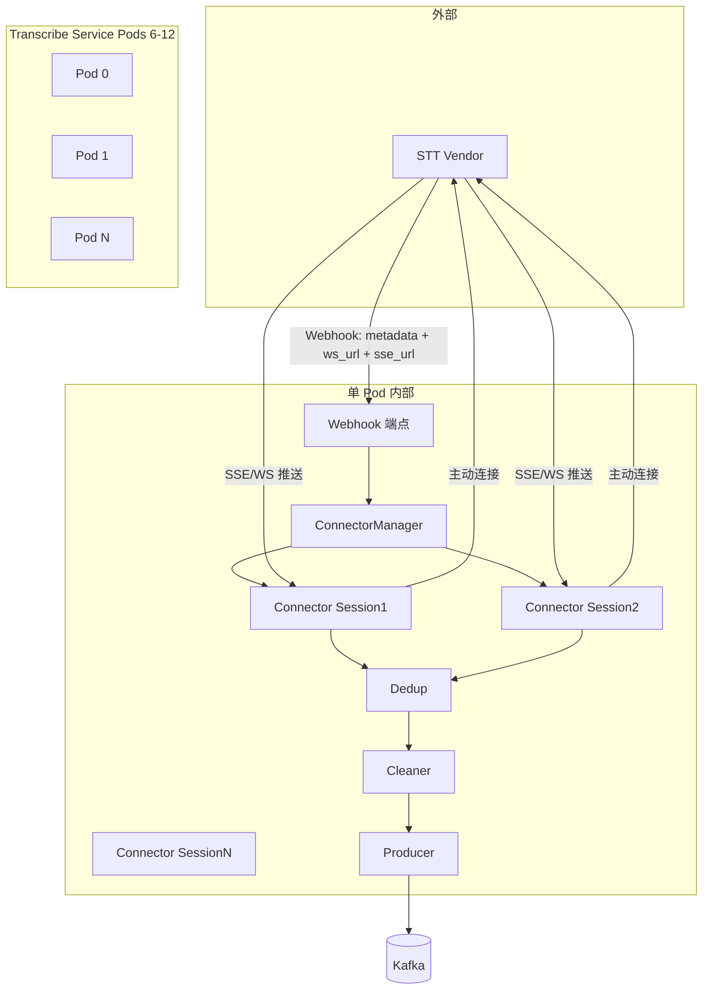

# Transcribe Service 应用设计说明书

本文档说明 Transcribe Service 直连模式的应用架构、模块设计、数据流及多协程 Connector 管理。

---

## 1. 目标与约束

### 1.1 目标

- 支撑 600 并发会话
- 6–12 Pod 水平扩展
- 严格 seq_no 顺序

### 1.2 约束

- **直连模式**：无 Redis Stream/Buffer
- **设计范围**：仅考虑 STT Vendor 对接，不涉及呼叫中心路由

---

## 2. 架构总览



**说明**：Vendor 通过 Webhook 通知 Transcribe Service 新会话（含 metadata、ws_url、sse_url）；Transcribe Service Webhook 接收后 ConnectorManager 建立连接，Transcribe Service 作为客户端向 Vendor 发起 SSE/WebSocket 连接。

---

## 3. 核心设计要点

### 3.1 Webhook 触发

Vendor STT 向 Transcribe Service Webhook 发送新会话通知，Payload 仅含：

- `metadata`：会话元数据（含 session_id 等）
- `ws_url`：WebSocket 连接地址
- `sse_url`：SSE 连接地址

### 3.2 ConnectorManager 建连

Webhook 接收后，ConnectorManager 根据配置选择 SSE 或 WebSocket，向对应 URL 发起连接。

### 3.3 多协程 Connector 管理

- 每 Pod 运行一个 `ConnectorManager`
- 为每个会话创建独立协程
- 单会话单 Connector，保证 seq_no 顺序

### 3.4 数据流

```
Vendor Webhook → ConnectorManager → Connector → Dedup → Cleaner → Producer → Kafka
```

---

## 4. 关键模块说明

| 模块 | 职责 | 关键类/函数 |
|------|------|-------------|
| Webhook 端点 | 接收 Vendor 推送的 metadata + ws_url + sse_url，调用 ConnectorManager | `POST /webhook` 或可配置路径 |
| ConnectorManager | 根据 Webhook 数据创建 Connector，建立 SSE/WS 连接 | `add_session(metadata, ws_url, sse_url)` |
| Dedup | 按 session_id+seq_no 去重 | 沿用 [transcription_ingest/dedup/](../../src/transcription_ingest/dedup/) |
| Cleaner | 数据清洗，输出 raw + cleaned | 沿用 [transcription_ingest/transform/](../../src/transcription_ingest/transform/) |
| Producer | 写入 Kafka，key=session_id | 沿用 [transcription_ingest/producer/](../../src/transcription_ingest/producer/) |

---

## 5. 配置扩展

在 [config/settings.py](../../config/settings.py) 中新增：

| 配置项 | 说明 | 示例 |
|--------|------|------|
| `transcribe_service_max_sessions_per_pod` | 每 Pod 最大会话数 | 100 |
| `transcribe_service_webhook_path` | Webhook 接收路径 | `/webhook/session` |
| `transcribe_service_prefer_sse` | 优先使用 SSE 还是 WebSocket | `true` |

---

## 6. 相关文档

- [02-infrastructure-design.md](02-infrastructure-design.md) - Infra 设计
- [03-websocket-vs-sse-choice.md](03-websocket-vs-sse-choice.md) - 协议选择
- [04-vendor-interface-confirmation.md](04-vendor-interface-confirmation.md) - Vendor 接口确认
