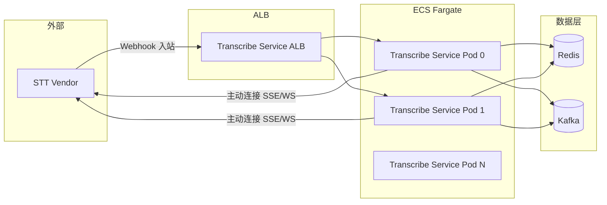

# Transcribe Service Infra 设计说明书

本文档说明 Transcribe Service 直连模式的基础设施设计，包括 ECS Fargate 部署、网络与安全。

---

## 1. 部署拓扑

**说明**：Vendor 通过 Webhook 入站通知 Transcribe Service；Transcribe Service 收到后主动连接 Vendor 提供的 SSE/WS URL。需 ALB 暴露 Webhook 入站端口。

---

## 2. ECS Fargate 设计

### 2.1 服务配置

- **Transcribe Service 服务**：6–12 任务，每任务 1 容器
- **资源估算**：CPU/Memory 按 100 会话/任务估算
- **扩缩容**：按活跃会话数或 CPU 利用率自动扩缩

### 2.2 任务定义

- 容器镜像：Transcribe Service 应用镜像
- 环境变量：Redis URL、Kafka 地址、Webhook 路径等
- 健康检查：HTTP 探针指向 Webhook 或健康端点

---

## 3. 网络与安全

### 3.1 入站

- Transcribe Service 需暴露 Webhook HTTP 端点，供 Vendor 调用
- 通过 ALB + 安全组实现
- 建议使用 HTTPS

### 3.2 出站

- Transcribe Service 需可访问 STT Vendor（公网或 VPC 对等）
- 用于连接 Webhook 中的 ws_url/sse_url

### 3.3 数据层

- Redis、Kafka 置于 VPC 内
- Transcribe Service 通过安全组访问

---

## 4. 相关文档

- [01-application-design.md](01-application-design.md) - 应用设计
- [05-best-practices.md](05-best-practices.md) - 行业最佳实践
