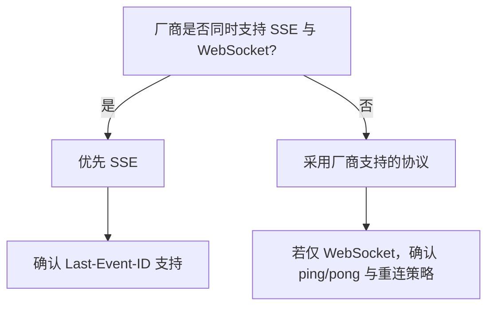

# WebSocket vs SSE 明确选择

本文档对比 WebSocket 与 SSE，给出 Transcribe Service 直连模式的协议选择建议。

---

## 1. 对比矩阵

| 维度 | SSE | WebSocket |
|------|-----|-----------|
| 方向 | 服务端→客户端 | 双向 |
| 协议 | HTTP，Last-Event-ID 断点续传 | 独立协议，需应用层实现 |
| 代理/防火墙 | 兼容性好 | 部分代理可能限制 |
| 实现复杂度 | 简单（httpx 流式） | 需 ping/pong、帧处理 |
| 厂商支持 | 常见 | 常见 |

---

## 2. 决策结论

**推荐：SSE**

### 2.1 理由

1. **单向推送**：转录场景为服务端→客户端单向推送，无需客户端→服务端消息
2. **断点续传**：SSE 原生支持 `Last-Event-ID`，断线重连可无缝续传，符合 [connector/reconnect.py](../../src/transcription_ingest/connector/reconnect.py) 设计
3. **实现简单**：与现有 [connector/sse.py](../../src/transcription_ingest/connector/sse.py) 一致
4. **兼容性**：HTTP 协议，代理/防火墙兼容性更好

### 2.2 例外

若厂商仅支持 WebSocket，则选 WebSocket，并在 [04-vendor-interface-confirmation.md](04-vendor-interface-confirmation.md) 中明确 ping/pong 与重连策略要求。

---

## 3. 选择流程

---

## 4. 相关文档

- [04-vendor-interface-confirmation.md](04-vendor-interface-confirmation.md) - Vendor 接口确认
- [01-application-design.md](01-application-design.md) - 应用设计
