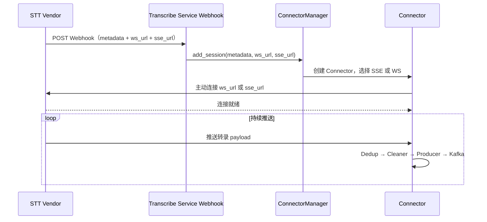

# Vendor 接口确认说明书

本文档为 Transcribe Service 与 STT Vendor 对接的确认清单，供与厂商对齐使用。

---

## 1. 范围与对接模式

**范围**：仅确认 Transcribe Service 与 **STT Vendor** 的对接，不涉及呼叫中心。

**对接模式**：**Vendor Webhook + Transcribe Service 主动连接**。Vendor 向 Transcribe Service Webhook 发送新会话通知（仅含 metadata、ws_url、sse_url）；Transcribe Service 接收后 ConnectorManager 建立连接。

---

## 2. 确认清单

| 序号 | 确认项 | 说明 | 必选 |
|------|--------|------|------|
| 1 | Webhook Payload | 必须包含：metadata、ws_url、sse_url；metadata 中需含 session_id 等会话标识 | 是 |
| 2 | 协议类型 | SSE 或 WebSocket，是否支持 Last-Event-ID（SSE） | 是 |
| 3 | Payload 结构 | `result.sessionId`, `result.processingId`, `result.transcripts`, `seq_no` 等字段定义 | 是 |
| 4 | 连接生命周期 | 建立、断开、超时、重连策略 | 是 |
| 5 | 认证方式 | Token、API Key、证书等（Transcribe Service 发起连接时如何携带） | 视厂商 |
| 6 | 限流与背压 | 推送速率、背压信号 | 建议 |

---

## 3. 对接流程示意



---

## 4. Webhook Payload 示例

```json
{
  "metadata": {
    "session_id": "sess-xxx",
    "processing_id": "proc-xxx"
  },
  "ws_url": "wss://vendor.example.com/stream/xxx",
  "sse_url": "https://vendor.example.com/stream/xxx"
}
```

---

## 5. 相关文档

- [01-application-design.md](01-application-design.md) - 应用设计
- [03-websocket-vs-sse-choice.md](03-websocket-vs-sse-choice.md) - 协议选择
