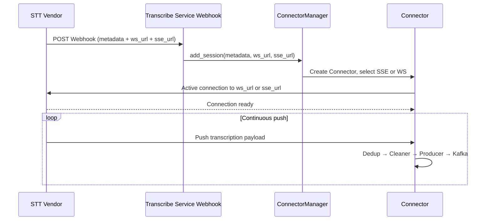

# Vendor Interface Confirmation

This document specifies the checklist for integrating Transcribe Service with STT Vendors.

---

## 1. Scope and Integration Mode

**Scope**: Only covers the integration between Transcribe Service and **STT Vendor**; does not include call center routing.

**Integration Mode**: **Vendor Webhook + Transcribe Service Active Connection**. The Vendor sends new session notifications to the Transcribe Service Webhook (metadata, ws_url, sse_url only); Transcribe Service receives and ConnectorManager establishes connections.

---

## 2. Confirmation Checklist

| # | Item | Description | Required |
|---|------|--------------|----------|
| 1 | Webhook Payload | Must include: metadata, ws_url, sse_url; metadata must contain session_id and other session identifiers | Yes |
| 2 | Protocol Type | SSE or WebSocket; whether Last-Event-ID (SSE) is supported | Yes |
| 3 | Payload Structure | Field definitions for `result.sessionId`, `result.processingId`, `result.transcripts`, `seq_no`, etc. | Yes |
| 4 | Connection Lifecycle | Establishment, termination, timeout, reconnect strategy | Yes |
| 5 | Authentication | Token, API Key, or certificate (how Transcribe Service carries credentials when initiating connection) | Per vendor |
| 5a | Webhook Authentication | Recommend HTTPS + HMAC-SHA256 signature (see Section 5) | Recommended |
| 6 | Rate Limiting & Backpressure | Push rate, backpressure signals | Recommended |

---

## 3. Integration Flow



---

## 4. Webhook Payload Example

```json
{
  "metadata": {
    "session_id": "sess-xxx",
    "processing_id": "proc-xxx"
  },
  "ws_url": "wss://vendor.example.com/stream/xxx",
  "sse_url": "https://vendor.example.com/stream/xxx"
}
```

---

## 5. Webhook Authentication Recommendation

**Recommend Vendor STT use HTTPS + HMAC for Webhook authentication** to verify request origin and prevent spoofing and replay attacks.

### 5.1 Transport Layer: HTTPS

- Webhook URL must use **HTTPS** (production)
- HTTP may be used for local Demo

### 5.2 Application Layer: HMAC Signature

- **Algorithm**: HMAC-SHA256
- **Header**: `X-Webhook-Signature: sha256=<hex>`
- **Computation**: `HMAC-SHA256(secret, raw_body).hexdigest()`
- **Secret**: Shared key between Vendor and Transcribe Service; generated by Transcribe Service and configured for Vendor

**Vendor-side signing example**:

```python
import hmac
import hashlib

def sign_payload(secret: str, body: str | bytes) -> str:
    if isinstance(body, str):
        body = body.encode()
    return "sha256=" + hmac.new(secret.encode(), body, hashlib.sha256).hexdigest()
# Set header: X-Webhook-Signature: sign_payload(secret, raw_json_body)
```

**Note**: The signature must be computed over **raw request body bytes**. Do not use re-serialized JSON after parsing, as key order, whitespace, etc. may cause verification failure.

### 5.3 Configuration

- Transcribe Service configures secret via `TRANSCRIBE_SERVICE_WEBHOOK_SECRET`
- When secret is configured, requests must include a valid signature; otherwise 401 is returned
- When secret is not configured, signature verification is skipped (Demo/local development only)

---

## 6. Related Documents

- [design-overview.en.md](design-overview.en.md) - Design overview
- [configuration.md](configuration.md) - Configuration
