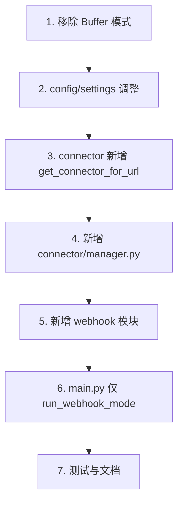

# Transcribe Service 代码调整计划

根据 [docs/specs/01-application-design.md](../docs/specs/01-application-design.md) 等设计文档，将现有单连接架构调整为 **Webhook + ConnectorManager** 多会话架构。

---

## 1. 变更概览

| 变更类型   | 说明                                                |
| ------ | ------------------------------------------------- |
| **移除** | Redis Buffer 模式、单连接模式（Legacy）                     |
| **新增** | Webhook HTTP 端点、ConnectorManager、Demo Webhook 发送端 |
| **修改** | config/settings、main.py、connector 工厂              |
| **保留** | Dedup、Cleaner、Producer                            |

**运行模式**：**统一 Webhook 模式**，正式环境与 Demo 均使用。

- **正式环境**：Vendor 推送 Webhook → Transcribe Service → ConnectorManager 建连
- **Demo**：Mock Webhook 发送端推送 Webhook（sse_url 指向 Mock STT 服务）→ Transcribe Service → ConnectorManager 建连

---

## 2. 配置调整 (config/settings.py)

**移除**：`redis_buffer_enabled`、`redis_buffer_stream`、`redis_buffer_consumer_group`、`redis_buffer_maxlen`、`redis_buffer_block_ms`；`stt_provider_url`、`mode`（单连接模式已移除）

**新增**：

```python
# Transcribe Service 直连模式（统一 Webhook，无模式分支）
transcribe_service_max_sessions_per_pod: int = 100
transcribe_service_protocol: str = "sse"  # "sse" 或 "websocket"
```

**固定于代码**：Webhook 路径 `/webhook/session`、host `0.0.0.0`、port `8080` 写死。Host/Port 由 Docker/ECS 任务定义与 ALB 编排，无需 env 配置。

---

## 2.1 移除 Buffer 模式

| 操作  | 路径                                                                                                        |
| --- | --------------------------------------------------------------------------------------------------------- |
| 删除  | `src/transcription_ingest/buffer/` 目录                                                                     |
| 删除  | `scripts/clear_redis_buffer.py`、`scripts/test_redis_stream.py`                                            |
| 修改  | `main.py`：移除 Buffer 分支、`connect_and_push`、`RedisBufferConsumer` 等调用                                       |
| 修改  | `connector/sse.py`、`connector/websocket.py`：移除 `connect_and_push`、`BufferBackend`                         |
| 修改  | `docs/configuration.md`、`docs/faq.md`、`docs/pyproject-config.md`、`docs/troubleshooting.md`：移除 Buffer 相关说明 |

---

## 3. Connector 工厂扩展 (connector/__init__.py)

- **移除** `get_connector(settings, last_event_id)`（Legacy 单连接模式已废弃）
- **新增** `get_connector_for_url(url, *, use_sse: bool, last_event_id=None, ...)`：根据 `url` 和 `use_sse` 返回 SseConnector 或 WebSocketConnector，供 ConnectorManager 使用

---

## 4. 新增 ConnectorManager (connector/manager.py)

| 职责    | 实现                                                                          |
| ----- | --------------------------------------------------------------------------- |
| 管理多会话 | `Dict[session_id, asyncio.Task]`                                            |
| 添加会话  | `add_session(metadata, ws_url, sse_url)` → 创建 Connector，启动 `run_session` 协程 |
| 移除会话  | `remove_session(session_id)` → cancel 对应 Task                               |
| 单会话处理 | `run_session`：connect → Dedup → Cleaner → Producer，异常时 remove_session       |

依赖注入：Dedup、Cleaner、Producer、Settings（含 protocol、timeouts 等）。

---

## 5. 新增 Webhook 模块 (webhook/)

使用 **FastAPI + Uvicorn** 实现 Webhook HTTP 服务。

| 文件                    | 职责                                                                                                 |
| --------------------- | -------------------------------------------------------------------------------------------------- |
| `webhook/__init__.py` | 导出 `create_app`、`WebhookPayload` 模型                                                                |
| `webhook/routes.py`   | FastAPI 路由：`POST /webhook/session`（固定路径）接收 WebhookPayload，校验 session_id，调用 `connector_manager.add_session`，返回 202 |

**实现要点**：

- FastAPI `APIRouter` 注册固定路径 `/webhook/session`
- Pydantic 模型 `WebhookPayload(metadata, ws_url, sse_url)` 自动校验请求体
- 依赖注入：`ConnectorManager` 通过 `app.state` 或 `Depends` 传入
- 启动：使用 `uvicorn.Server(config).serve()`（异步），host=0.0.0.0、port=8080 固定于代码

---

## 6. 主入口调整 (main.py)

**原则**：主逻辑零 Demo 污染，不导入 demo 模块。**禁止**使用模式开关做分支，不实现 `run_direct_mode`。

**主流程**：仅 Webhook 模式，入口直接调用 `run_webhook_mode()`，无分支。

**移除**：`_use_buffer_mode`、Buffer 相关分支、`run_ingest(redis_buffer_enabled)` 参数、单连接模式入口（main 中 `connect_fn` 调用）。**保留** `reconnect.py`，ConnectorManager 内部复用 `run_with_reconnect`

**run_webhook_mode**（async）：

1. 初始化 Dedup、Cleaner、Producer、ConnectorManager
2. 创建 FastAPI Application，注册 Webhook 路由
3. 使用 `uvicorn.Server(config).serve()` 异步启动（host=0.0.0.0, port=8080 固定）
4. 注册 GracefulShutdown，收到 SIGTERM 时停止接收新请求、等待活跃会话、关闭服务

---

## 7. Demo 适配 (demo/)

**原则**：Demo 为独立编排层，仅通过标准 Webhook 接口与主服务交互；主逻辑不感知 Demo。

**Demo 流程**：启动 Transcribe Service（Webhook 模式）+ Mock STT 服务 + Mock Webhook 发送端；**启动时自动**向 `http://localhost:8080/webhook/session` POST（sse_url 指向 Mock STT），固定 `session_id` 如 `demo-session-1`。

---

## 8. 测试调整

| 文件                                   | 变更                                                       |
| ------------------------------------ | -------------------------------------------------------- |
| `tests/test_buffer.py`               | **删除**（Buffer 模式已移除）                                     |
| `tests/test_connector.py`            | 移除 `connect_and_push` 相关用例；新增 `get_connector_for_url` 测试 |
| `tests/test_reconnect.py`            | 移除或保留（ConnectorManager 内部可复用重连逻辑）                        |
| `tests/test_config.py`               | 移除 `redis_buffer_stream` 断言                              |
| 新增 `tests/test_connector_manager.py` | ConnectorManager 单元测试（mock Dedup/Producer）               |
| 新增 `tests/test_webhook.py`           | Webhook 端点测试（POST 合法/非法 payload）                         |

**覆盖率**：保持对 `main.py` 的排除（pyproject.toml / coverage 配置）。

---

## 9. 文档与 .env

- [docs/architecture.md](../docs/architecture.md)：移除 Buffer 模式说明，补充 Webhook 模式架构图，仅保留直连模式
- [.env.example](../.env.example)：移除 REDIS_BUFFER_* 相关变量。Webhook 路径/host/port 均固定于代码，无需新增 env 示例

---

## 10. 实施顺序



---

## 11. 关键文件清单

| 操作    | 路径                                                                                                                                                                          |
| ----- | --------------------------------------------------------------------------------------------------------------------------------------------------------------------------- |
| 删除/精简 | `src/transcription_ingest/buffer/`（移除 Buffer 模式）                                                                                                                            |
| 修改    | config/settings.py                                                                                                                                    |
| 修改    | src/transcription_ingest/connector/__init__.py                                                                                                                             |
| 修改    | src/transcription_ingest/connector/sse.py、websocket.py（移除 connect_and_push） |
| 新增    | src/transcription_ingest/connector/manager.py                                                                                                                             |
| 新增    | src/transcription_ingest/webhook/__init__.py、routes.py（FastAPI 路由）                                                                                                      |
| 修改    | src/transcription_ingest/main.py                                                                                                        |
| 修改    | .env.example                                                                                                                                                |
| 修改    | docs/architecture.md                                                                                                                                |
| 新增    | tests/test_connector_manager.py、tests/test_webhook.py（使用 TestClient 测试 FastAPI）                                                                                       |
| 修改    | pyproject.toml：新增依赖 fastapi、uvicorn[standard]                                                                         |

---

## 12. 环境与兼容

| 环境       | 配置                | 行为                                                                        |
| -------- | ----------------- | ------------------------------------------------------------------------- |
| **正式环境** | 默认配置              | Vendor 推送 Webhook → Transcribe Service → ConnectorManager 建连              |
| **Demo** | 默认配置，Mock 服务 8765 | Mock Webhook 发送端 POST http://localhost:8080/webhook/session → ConnectorManager 连接 Mock STT |
