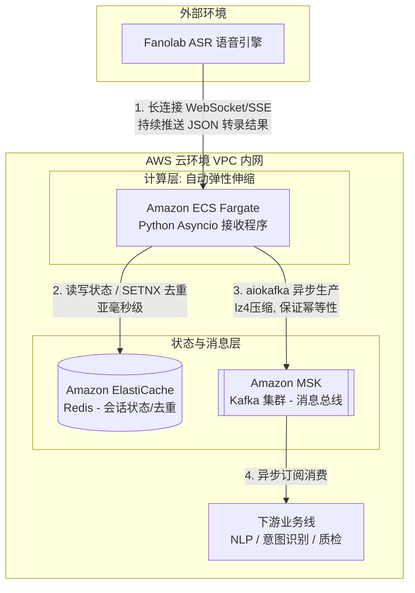
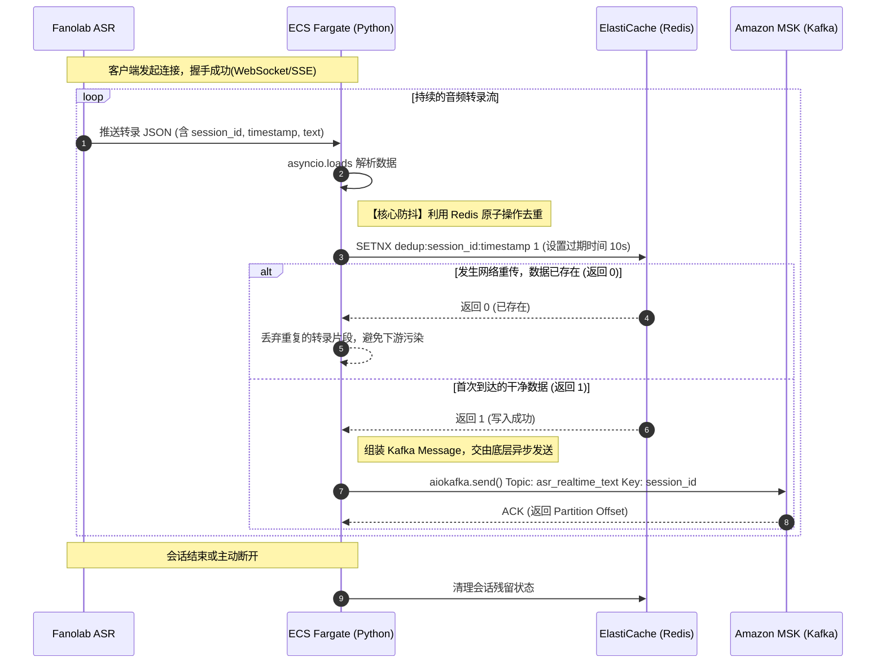
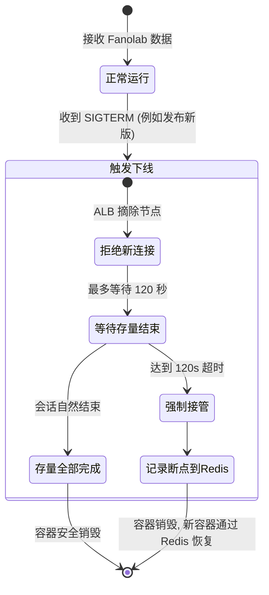

# 实时 ASR 转录接入与分发系统设计报告

在咱们实际的生产环境中，高并发的长连接最怕的就是"网络抖动"和"下游阻塞"。这份报告和图表，就是为了说明我们如何利用 AWS 基础组件和 Python 的异步特性，做一个"扛造"的数据搬运工。

## 1. 宏观架构设计图 (High-Level Design)

这套架构主打一个"各司其职"：Fargate 专心做高并发 I/O，Redis 负责挡掉脏数据（去重），MSK 负责把数据安全地存下来等下游慢慢吃。

**架构大白话解析：**

- **ECS Fargate**：咱们没用 EC2，省得自己管机器打补丁。Fargate 能根据长连接的数量自动弹，早晚高峰完全不用人工干预。
- **ElastiCache (Redis)**：真实网络环境下，ASR 引擎重连时经常会把上一秒的话再发一遍。把 Redis 放在这里，就是为了做个快速"滤网"，哪怕它发了两遍，我们也只让一条进 Kafka。

## 2. 核心数据流转时序图 (Sequence Diagram)

这张图展示了从收到 Fanolab 的一句话，到最终落盘到 Kafka 的微秒/毫秒级交互过程。重点看去重防抖的逻辑。

**时序图接地气解析：**

- **第 4 步的 SETNX**：这是点睛之笔。在极短的时间窗口内（比如 10 秒），用 session_id 加时间戳（或者消息序号）做唯一 Key。谁先抢到坑（返回 1），谁就发给 Kafka；慢一步的重复数据（返回 0）直接被无视。
- **Kafka Key 的设计**：我们在发送给 MSK 时，一定要把 session_id 设置为 Kafka message 的 Key。这样能保证同一个通话的所有文本，都会落到 Kafka 的同一个 Partition 里，下游处理时顺序绝对不会乱。

## 3. 容灾与优雅停机 (Graceful Shutdown) 流程图

发布新版本时，最怕强杀进程导致正在转录的电话断掉。这是一个简单的状态机流转图：

这种设计在客服中心或者实时业务里非常实用，哪怕一天发版十次，用户端也不会有任何感知。
